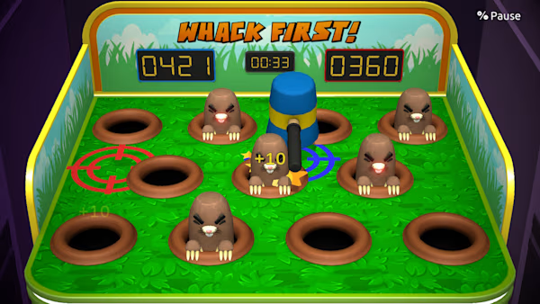
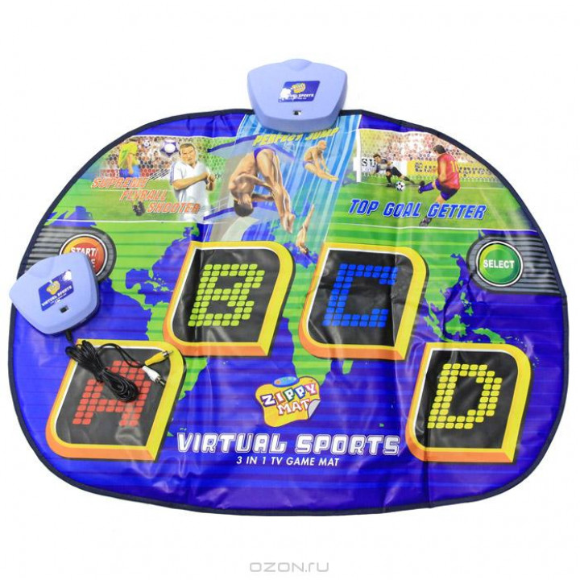
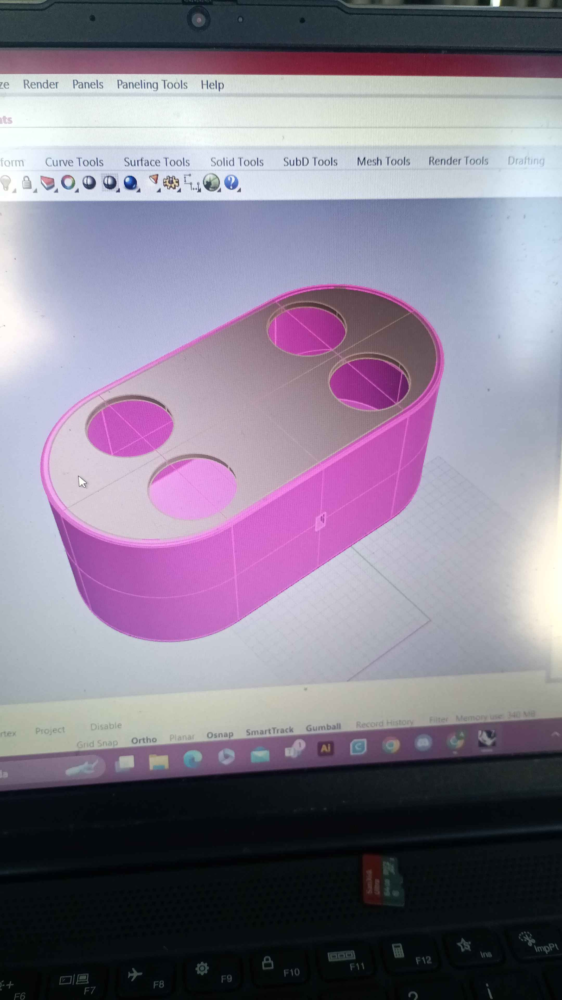
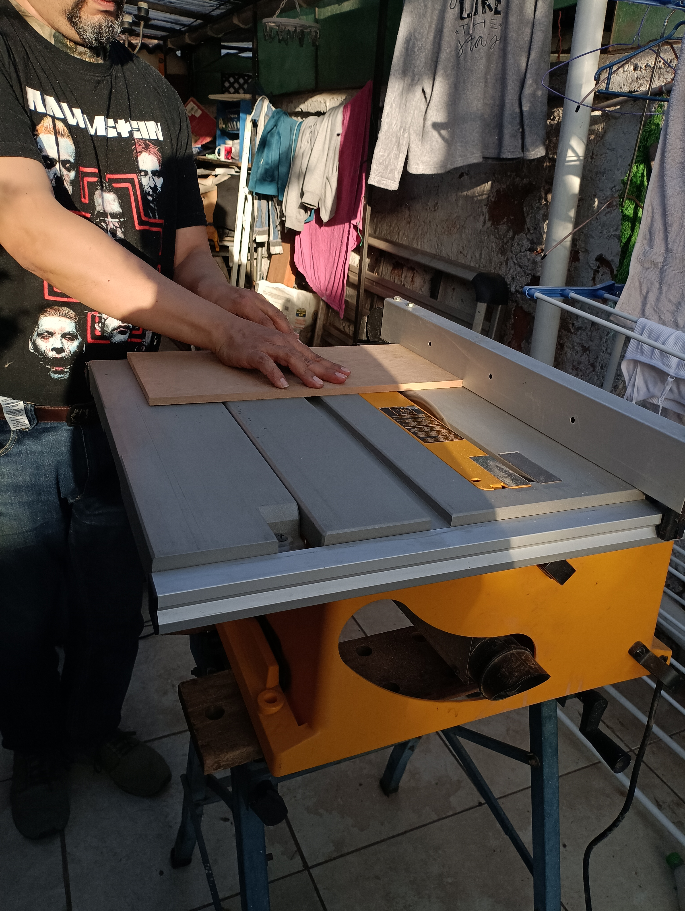
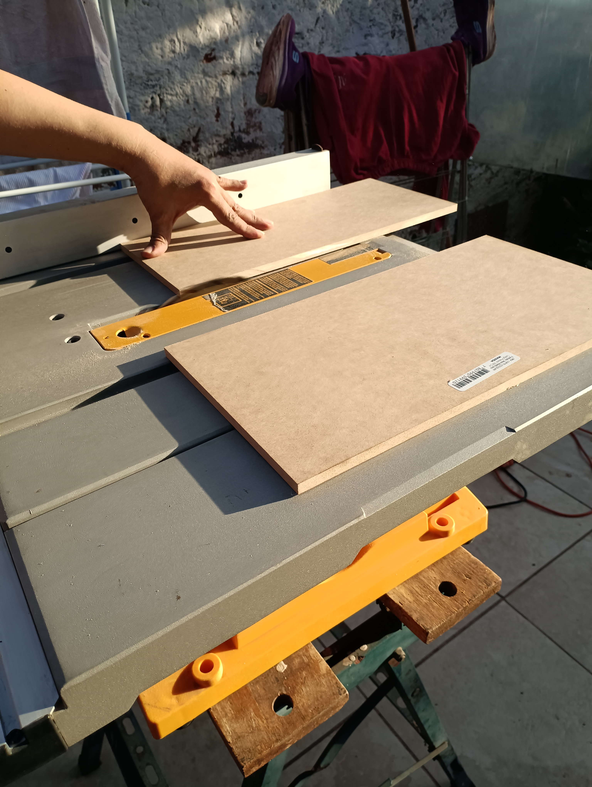
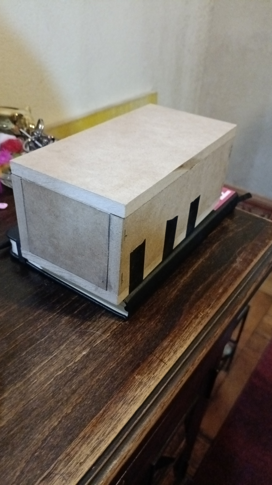
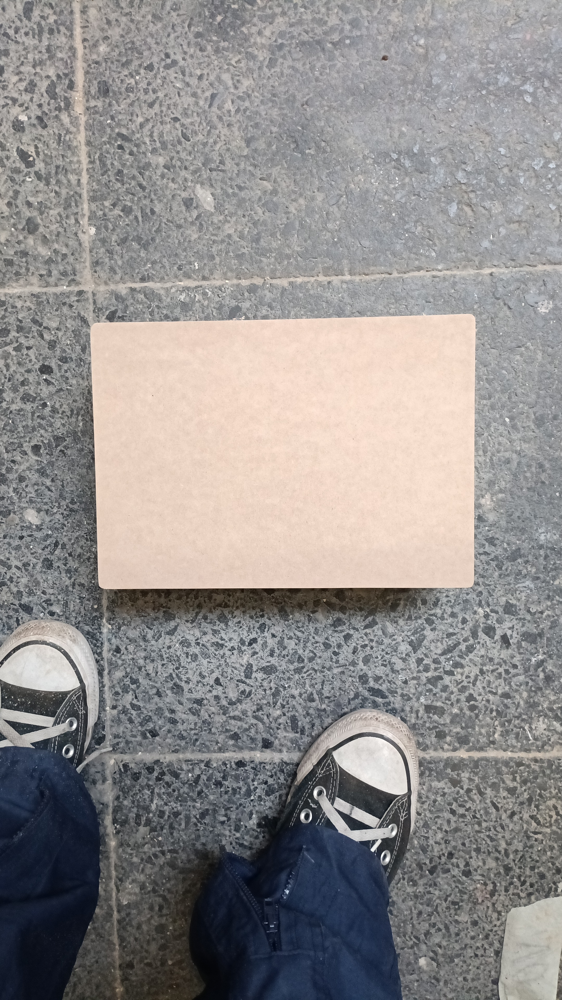
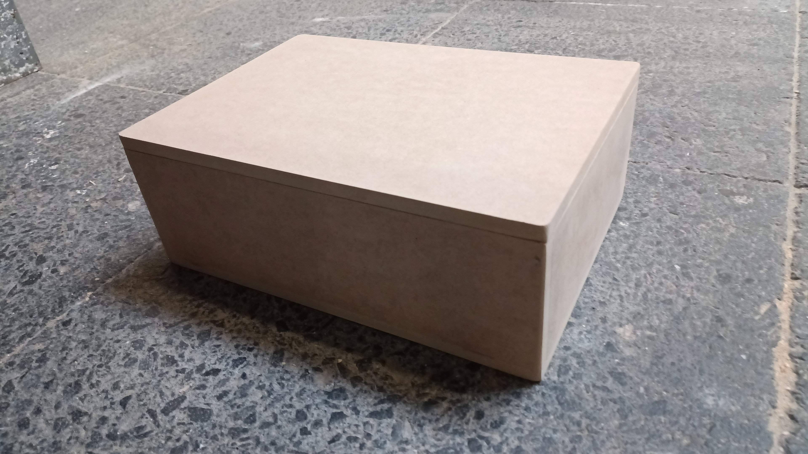
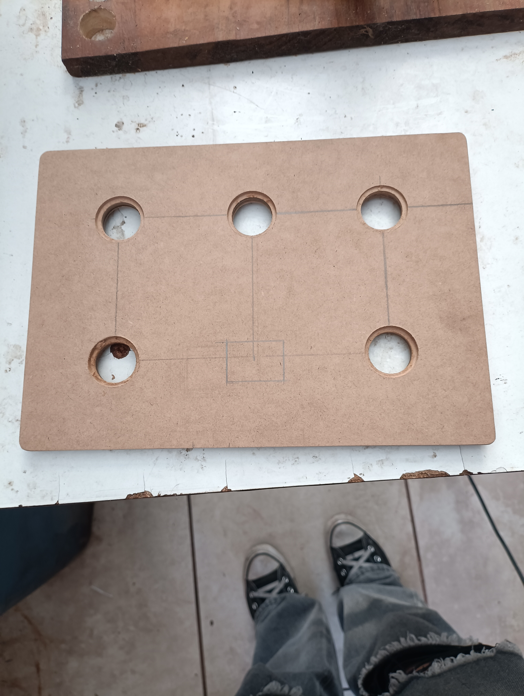
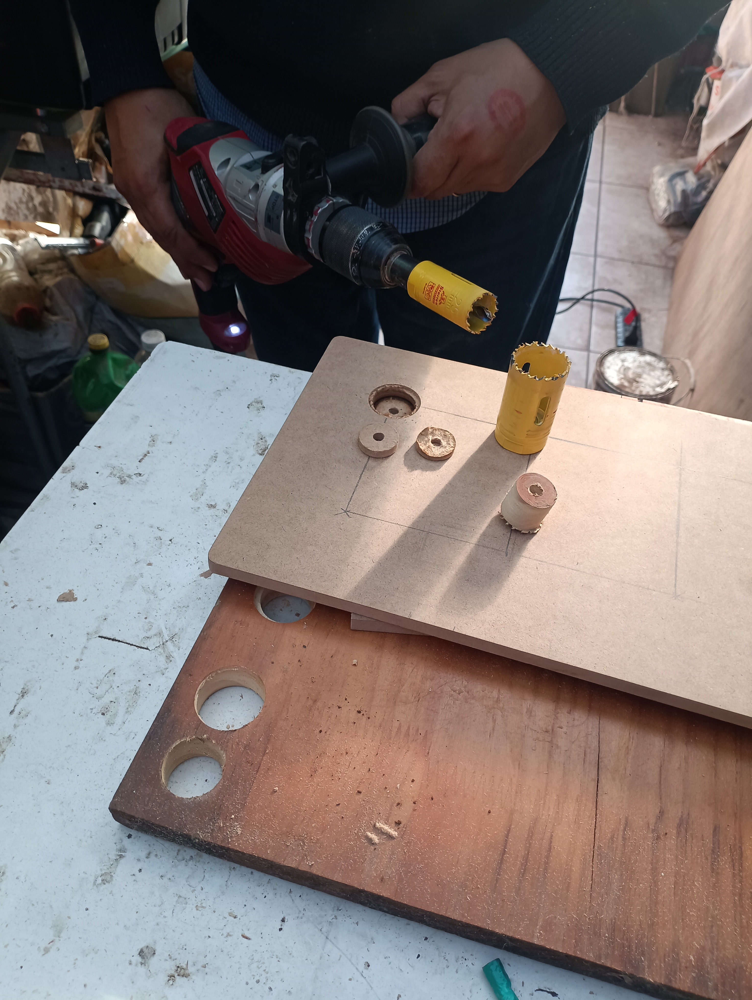

# clase-04
## VOCAL HUNT 

Con [@SofiaEct](https://github.com/SofiaEct/dis8637-2024-2)  ideamos el proyecto __"VOCAL HUNT"__ que trata de un juego interactivo que combina el tiempo de reacción y reflejos del jugador, inspirado por el juego _“whack-a-mole”_. El objetivo del juego es poner nervioso al jugador, ya que tiene un tiempo límite para presionar cada vocal como lo sería el juego_”pop it”_ y además funciona con vidas. A medida que los jugadores avanzan las secuencias, estos aumentan en dificultad. 

El propósito principal de "VOCAL HUNT" es desarrollar y mantener las habilidades motoras finas y reflejos, especialmente en grupos etarios que pueden encontrar desafíos particulares en estas áreas, como niños en desarrollo y adultos mayores. Al enfocarse en la velocidad de reacción y la coordinación ojo-mano, el juego ofrece un entrenamiento cognitivo y físico divertido y accesible.

## REFERENTES

***Ejemplo del juego whack-a-mole***

***Ejemplo del juego pop it***

https://github.com/user-attachments/assets/cc712618-53b4-4c0d-a535-d1b04aa49962

***Ejemplo de virtual sports play dance mat***

## DISEÑO Y MATERIALES

Ideamos el diseño del dispositivo como una caja de madera, en la cual tendría sus respectivas instrucciones y guías gráficas para el uso del mismo.

***Boceto de "VOCAL HUNT"***

***Imagen de [@brandnewnoise](https://www.instagram.com/brandnewnoise)***

***Materiales***

1. Madera mdf
2. Botones / pulsadores led Arcade
3. Arduino
4. Cables de conexión

***jugabilidad***

El jugador se enfrenta a un panel con 5 botones, cada uno representando una vocal (A, E, I, O, U). En la pantalla central se mostrará una secuencia de vocales que deberá seguir al pie de la letra. Cada vocal aparecerá con un temporizador que marca el tiempo límite para reaccionar. El jugador debe concentrarse y actuar con rapidez, presionando el botón correcto antes de que se agote el tiempo.

El jugador cuenta con 2 vidas, y perderá una cada vez que cometa un error o no presione el botón a tiempo. A medida que el juego avanza, las secuencias se vuelven más rápidas y complicadas, aumentando la presión. El reto consiste en mantener la calma y reaccionar con precisión, pues cuando las 2 vidas se agoten, el juego terminará.

## Construcción del objeto

Al principio intentamos hacer una estructura transportable, es decir pequeña. Primero lo intentamos hacer con impresión 3d donde [@AlanisMria](https://github.com/AlanisMria/dis8637-2024-2) me ayudo a modelar, con un tiempo de espera de 12 hrs y que terminó fallando
.

Descubrimos que falló porque confundimos un filamento ABS por uno PLA

Luego siguiendo con la idea de la transportabilidad hicimos una caja chiquita con la ayuda de mi papá

Al final no cabía ningún circuito en la caja así que se hizo una mas grande

para hacerle los agujeros requerimos de la ayuda de mi padre nuevamente

El problema de hacer los ahgujeros era que el MDF se quemaba y se pegaba en la broca demorandonos más en hacer todos los agujeros

https://github.com/user-attachments/assets/67e6b9ee-4b94-49aa-abf2-10c8dd6cbc03

## DIAGRAMA DE FLUJO

tarea: quiero jugar al juego de secuencia

casos limites:

1. Conecta al juego a una fuente de energía a través de un cable usb
2. El juego queda en un estado de espera hasta que el jugador inicie el juego apretando cualquier tecla/botón
3. Las letras que aparecerán en el arduino corresponderá a la vocales, debes de apretar el botón con la letra que se muestra en la pantalla
gradualmente aumenta la complejidad de este juego, disminuyendo los intervalos en los que se muestra la vocal y agregado a eso a animaciones que indiquen que se acaba el tiempo de reacción, hay un margen de error de 2 intentos, al equivocarse una tercera vez el juego vuelve al modo de espera, y para volver a empezar hay que presionar cualquier botón
4. Una vez acabadas las 2 vidas el juego volverá a un modo de espera o después de un tiempo considerable de no interacción

