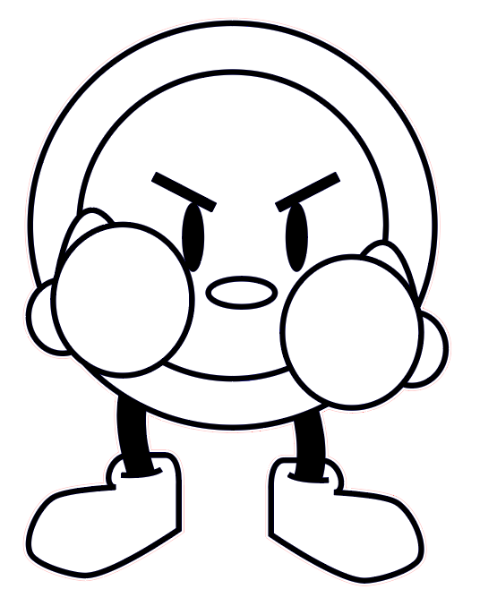
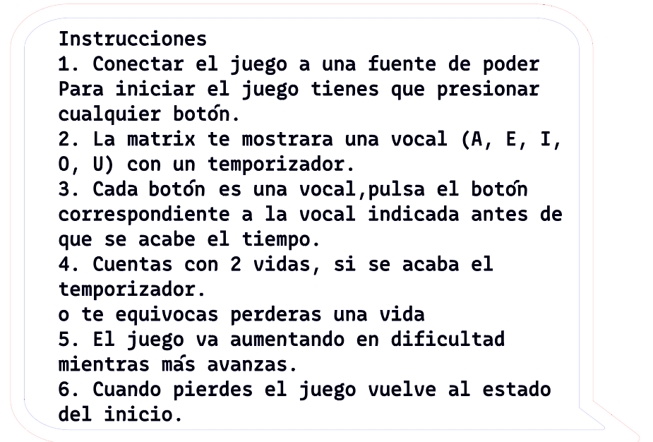
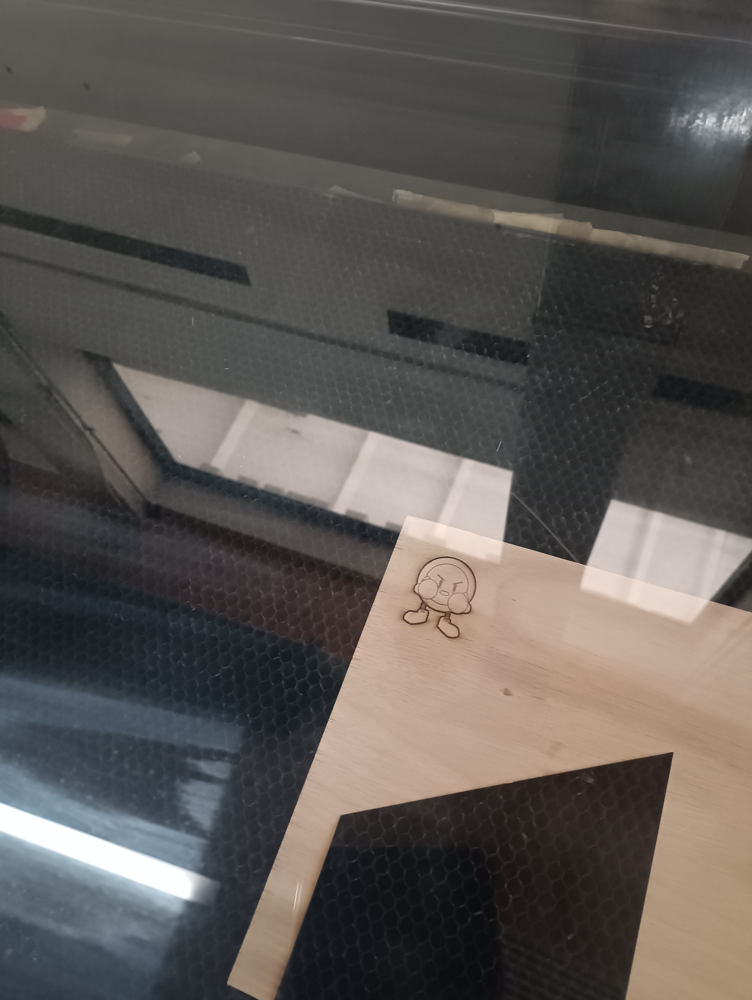
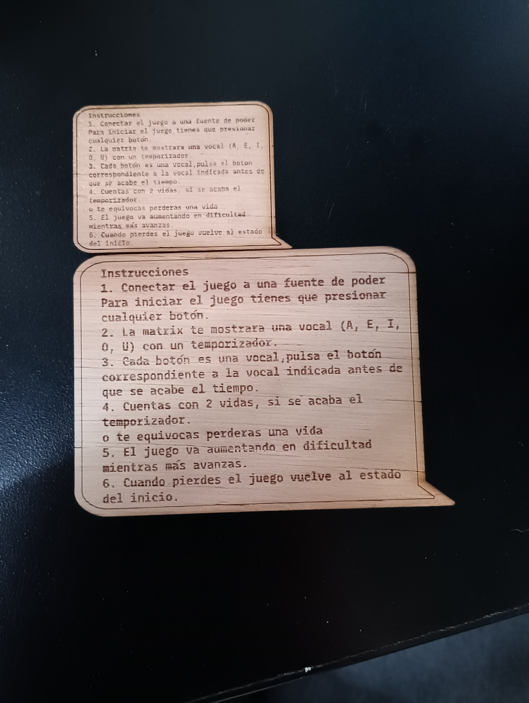
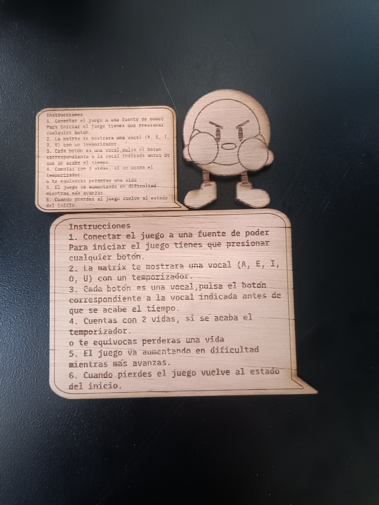

# clase-05
## Instrucciones y personaje :D
### personaje
Buttom es el personaje que nos da las instrucciones de como jugar **VOCAL HUNT**, lo cree yo como un botón arcade de los que se encuentran en el juego como un boxeador para invitar a golpear los botones

aqui se ve ya vectorizado

### instrucciones 
1. Conectar el juego a una fuente de poder
2. Para iniciar el juego tienes que presionar cualquier botón
3. La matrix te mostrará una vocal (A, E, I, O, U) con un temporizador
4. Cada botón es una vocal,pulsa el botón correspondiente a la vocal indicada antes de que se acabe el tiempo
5. Cuentas con 2 vidas, si se acaba el temporizador o te equivocas perderás una vida
6. El juego va aumentando en dificultad mientras más avanzas 
7. Cuando pierdes el juego vuelve al estado del inicio

### Corte laser del personaje e instrucciones

Tuvimos un error en dimensionar los tamaños 

aqui se aprecia como se ve el personaje al lado de las instrucciones

