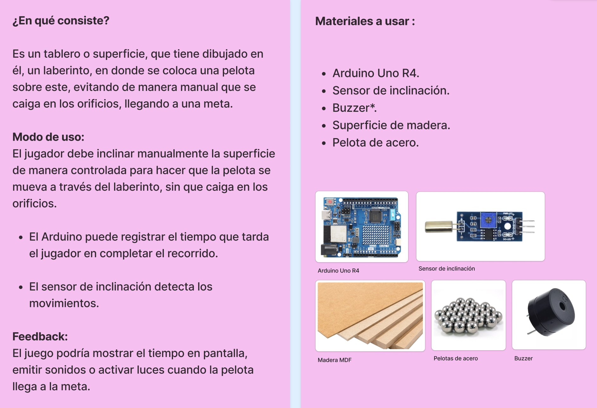
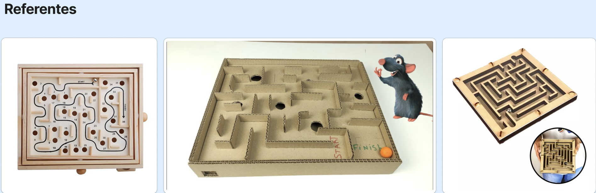
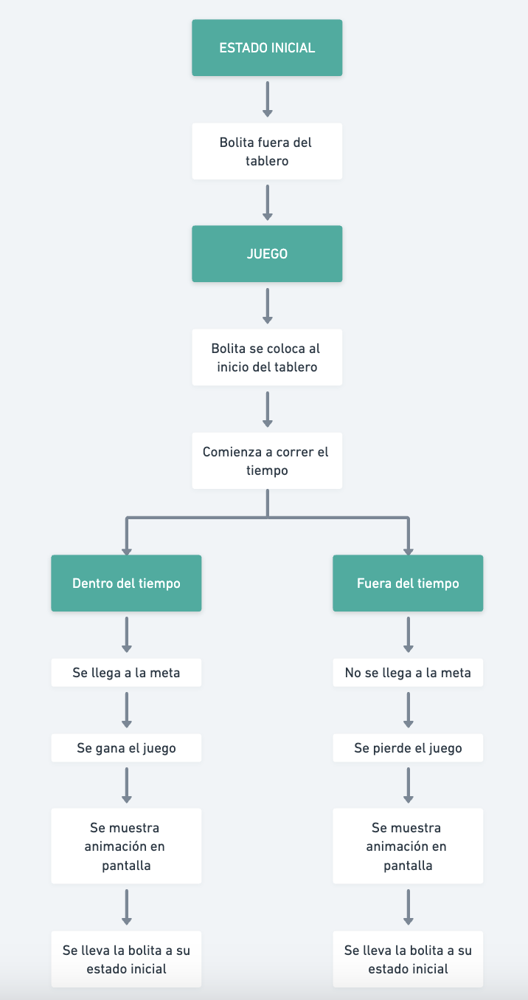

# clase-03

###### 27 de agosto del 2024

Entrega de encargo y correcciones.

### ENCARGO: Juego de habilidades: Laberinto

### Corrección encargo
+ Definir materialidad.
+ Definir dimensiones.
+ Detectar inicio y fin de la interacción, además del tiempo.
+ Ver dónde estará ubicada la pantalla del Arduino.
+ Explicar cómo va a funionar.
+ Que sea atractivo al usuario.
+ La pelota actuará como pulsador.
+ La pelota al caer, hace contacto y automáticamente empieza a correr el tiempo para poder llegar a la meta.

### Mapeo del funcionamiento del juego

  
