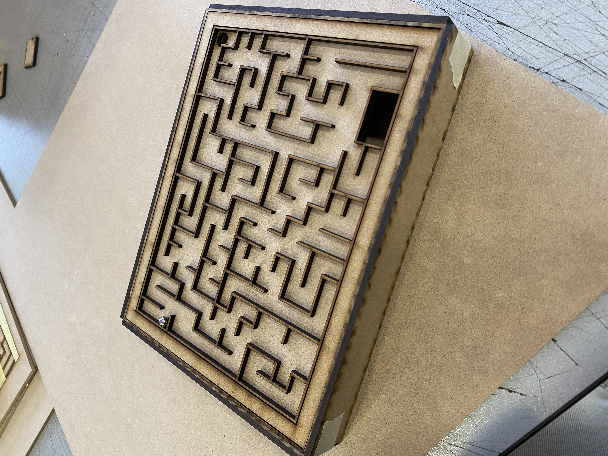

# clase-04

##### 3 de septiembre de 2024

Avances laberinto

*(plantilla de corte en archivos)

Para hacer el laberinto, se usó madera mdf en corte láser, dimensiones: 15 x 21 x 3 cm 

### Corrección encargo: Laberinto
+ Faltan las animaciones del tiempo, es decir, cuando se gana o cuando se pierde.
+ Para la animación del reloj/cronómetro, mostrarlo como un parpadeo, indicando se está acabando el tiempo.
+ Ver donde se inicia y donde termina el final del laberinto. Agregar leyendas.
+ Crear un botón como sensor, para que la pelotita actúe como pulsador y comience el juego.
  - botón debe tener cinta de aluminio o cobre para mejor conductividad.
  - ver ubicación de la pelotita en el laberinto.

### Apuntes

 const (comando que no varia a través del tiempo)

estado del botón 0 estado natural de las cosas

setup (condición inicial) termina la etapa cuando aparece }

Loop repetir, programaciones que se iniciaran después del setup

High= verdadero

´´´ (para citar en gibhub) - revisar gibhub profes clases profe

ctrl +f - buscar una palabra y remplazar una palabra

Standby = quieto

const (proteger una parte del codigo)

*BUTTON_PIN =numero - modificar el numero y se modificara en todo el codigo

En el loop se usa switch modifica el estado - Switch (Standby)

if (revisaboton) - estadoActual= ACTIVO esa accion dice que cada vez que se precione el boton realiza esa accion

case TRABAJANDO:

Serial.println

Variable- boolean - true/false

ctrol+t- ordenar código

Umbrales-

*libreria adafrut es recomendada

&& es para condicionar ej: if (distancia > Umbral - 15 && distancia < Umbral){ }

=o

estado s (No esta la bolita, esta la bolita y esta el tiempo, esta la bolita finalizo el tiempo)
CuentaRegresiva ()

case ACTIVO,

CuentaRegresiva ()

if (sensorFin () | | cuentaRegresiv ( ) )

estadoActual = Trabajando

## Laberinto

¿Qué es?
Un juego que busca alcanzar completar un circuito en un tiempo definido (tiempo mostrado por los led del arduino), donde el jugador que logre llegar al final del juego antes de que finalice el tiempo ganará el juego.

## Diagrama de flujo Laberinto

TAREA: quiero empezar a jugar.

CASOS LÍMITES: que la pelotita no esté en el tablero. que el tiempo empiece a correr y no esté la pelotita. que el tiempo no corra.

1. Tomar el tablero con ambas manos, de manera horizontal.
2. Asegurarse de que la pelotita este en el tablero. Si la pelotita no está, buscarla dentro de la base.
3. Verificar que el tiempo en pantalla no esté corriendo.
4. Tomar la pelotita y ubicarla en el inicio del laberinto.
5. Al momento de dejar la pelotita al inicio del laberinto, comienza el juego y empieza a correr el tiempo.
6. Verificar que el tiempo esté corriendo.
7. Comenzará a parpadear la pantalla, indicando que se agotará el tiempo límite.
8. En 40 segundos, se deberá llegar al final del laberinto, terminando el juego.
9. Al llegar al fnal del laberinto, se mostrará una animación indicando que ganaste o perdiste.

## ¿CÓMO USAR ARDUINO?

- Apuntes en base a tutorial arduino de Johann Perez E ( https://www.youtube.com/watch?v=gx5yFvVDUsY&list=PLyLh25DppBIe40j3VBAslnVfs4Pz-B3ZB ) Johann Perez E.

**PROGRAMAR**
**_void setup ()_** sólo se ejecuta una vez.
**_void loop ()_** se ejecuta constantemente.
**_void setup > pinmode (13, OUTPUT)_** avisa a Arduino que usare uno de los pines OUTPUT enviar info **y se usa ; para finalizar

Enviando info a través de lod pines **_void loop()> digitalWrite (13,HIGH)_**; para prender el led.

Para apagar el led 13 **_void loop()> digitalWrite (13,LOW);_**
al escribir bajo este el tiempo que se demore en encender _delay(1000)_; se mide en milisegundos y si lo volvemos a agregar bajo _LOW > delay(1000)_; se prende y apagara la luz en 1000 milisegundos.

** Uso de la protoboard (placa de prototipado)

**LEDS** : Pata larga es (+) y la pata corta (-) por lo que el LED se debe conectar de forma vertical ( Ej: en la fila 30 el polo positivo y en la 31 el negativo )

**RESISTENCIAS**: Para que pase solo la energía necesaria (para el ejemplo se usara una resistencia de 220v la patita quedara al positivo del led)

**CABLE JUMPER**: se usan los cables oscuros para aludir al - y el mas claro al + el cable se pasa primero por la resistencia (el mas claro +) luego conecto el cable a tierra , conectándolo al negativo del LED (cable oscuro -)

## Programar el led 
Luego para programar el LED se agregan 2 cables para conectar al pin 8 y al de tierra

**Programando lo siguiente**

https://youtube.com/shorts/_zaioiT6iik Parpadeo LED
y si se queremos queremos crear una variante en las velocidades se debemos volver a agregar los códigos las veces que queramos y modificar el tiempo (con este parpadea 3 veces lento y 3 veces rápido)

## INTENTOS DE PROGRAMACION
No nos funciono la biblioteca del sensor CapacitiveSensor.h
- Sensor tactil capacitivo por Rincon Ingenieril Youtube https://www.youtube.com/watch?v=V3l2Vj3lXZU https://www.rinconingenieril.es/sensor-capacitivo/ codigo :
  /Sensor Tactil capacitivo por Rincon Ingenieril //Uso de la libreria CapacitiveSensor.h de Paul Stroffregen
  #include <CapacitiveSensor.h>

CapacitiveSensor sensor = CapacitiveSensor(4,3);

void setup() { // put your setup code here, to run once: pinMode(12,OUTPUT); }

void loop() { // put your main code here, to run repeatedly: long lectura = sensor.capacitiveSensor(30);

if(lectura>1) digitalWrite(12,HIGH); else digitalWrite(12,LOW);

delay(10); }

## CONEXIÓN DEL ARDUINO

1. Sensor de toque capacitivo como interruptor, no se logro adecuar para nuestro sensor ya que este ya tenia un sensor de toque capacitivo TTP2233B https://www.squids.com.br/arduino/projetos-arduino/projetos-squids/basico/257-projeto-77-sensor-de-toque-capacitivo-como-interruptor-liga-e-desliga

Creando un sensor capacitivo con Arduino por Xukyo https://www.aranacorp.com/es/creando-un-sensor-capacitivo-con-arduino/ codigo:

//Libraries #include <CapacitiveSensor.h>//https://github.com/PaulStoffregen/CapacitiveSensor //Parameters bool autocal = 0; const int numReadings = 10; long readings [numReadings]; int readIndex = 0; long total = 0; const int sensitivity = 1000; const int thresh = 200; const int csStep = 10000; CapacitiveSensor cs = CapacitiveSensor(2, 3); void setup() { //Init Serial USB Serial.begin(9600); Serial.println(F("Initialize System")); //Init cs if (autocal == 0) { { cs.set_CS_AutocaL_Millis(0xFFFFFFFF); } } } void loop() { Serial.println(smooth()); } long smooth() { /* function smooth */ ////Perform average on sensor readings long average; // subtract the last reading: total = total - readings[readIndex]; // read the sensor: readings[readIndex] = cs.capacitiveSensor(sensitivity); // add value to total: total = total + readings[readIndex]; // handle index readIndex = readIndex + 1; if (readIndex >= numReadings) { readIndex = 0; } // calculate the average: average = total / numReadings; return average; }

2. Sensor de toque capacitivo como interruptor, no se logro adecuar para nuestro sensor ya que este ya tenia un sensor de toque capacitivo TTP2233B https://www.squids.com.br/arduino/projetos-arduino/projetos-squids/basico/257-projeto-77-sensor-de-toque-capacitivo-como-interruptor-liga-e-desliga

Creando un sensor capacitivo con Arduino por Xukyo https://www.aranacorp.com/es/creando-un-sensor-capacitivo-con-arduino/ codigo:

//Libraries #include <CapacitiveSensor.h>//https://github.com/PaulStoffregen/CapacitiveSensor //Parameters bool autocal = 0; const int numReadings = 10; long readings [numReadings]; int readIndex = 0; long total = 0; const int sensitivity = 1000; const int thresh = 200; const int csStep = 10000; CapacitiveSensor cs = CapacitiveSensor(2, 3); void setup() { //Init Serial USB Serial.begin(9600); Serial.println(F("Initialize System")); //Init cs if (autocal == 0) { { cs.set_CS_AutocaL_Millis(0xFFFFFFFF); } } } void loop() { Serial.println(smooth()); } long smooth() { /* function smooth */ ////Perform average on sensor readings long average; // subtract the last reading: total = total - readings[readIndex]; // read the sensor: readings[readIndex] = cs.capacitiveSensor(sensitivity); // add value to total: total = total + readings[readIndex]; // handle index readIndex = readIndex + 1; if (readIndex >= numReadings) { readIndex = 0; } // calculate the average: average = total / numReadings; return average; }

## CÓDIGO UTILIZADO
#include "Arduino_LED_Matrix.h" //Include the LED_Matrix library #include "animation.h" //Include animation.h header file

// Create an instance of the ArduinoLEDMatrix class ArduinoLEDMatrix matrix;

void setup() { pinMode(2, INPUT); pinMode(3, OUTPUT); }

void loop() { if (digitalRead(2) == HIGH) { digitalWrite(3, HIGH); matrix.loadSequence(animation); matrix.begin(); matrix.play(true); delay(10000); } else { digitalWrite(3, LOW); matrix.play(false); delay(1000); } }

**ANIMACIÓN**

const uint32_t animation[][4] = { { 0x30c20, 0x43fc3fc2, 0x430c000, 50 },

{
0x36c29,
0x41081082,
0x9436c000,
50
},

{
0x30c20,
0x43fc3fc2,
0x430c000,
50
},

{
0x0,
0x0,
0x0,
66,
},
};

