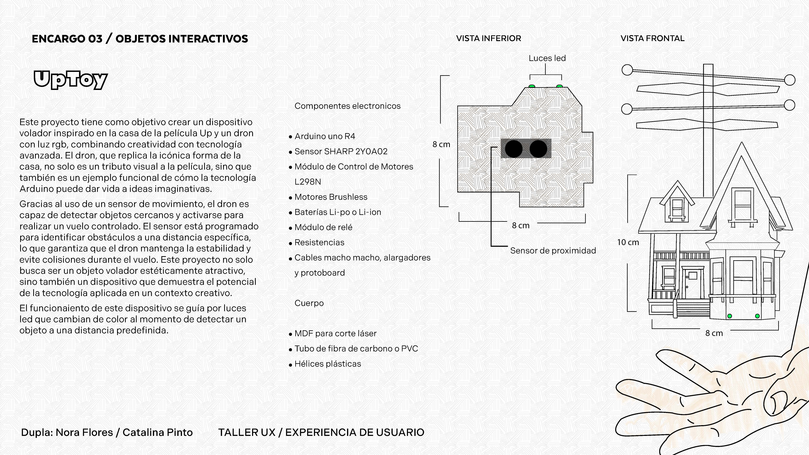

# clase-03

## encargo 3 yupi

## repositorios de github

1. https://github.com/RodrigoSturm14/Sensores-Sharp-2Y0A02

2. https://github.com/FullSensores/Sharp-2Y0A21-2Y0A02Y-Arduino

3. https://github.com/Martinsos/arduino-lib-hc-sr04

### pagina importante 

https://arduproject.es/medir-distancia-con-arduino-y-sensor-de-ultrasonidos-hc-sr04/
