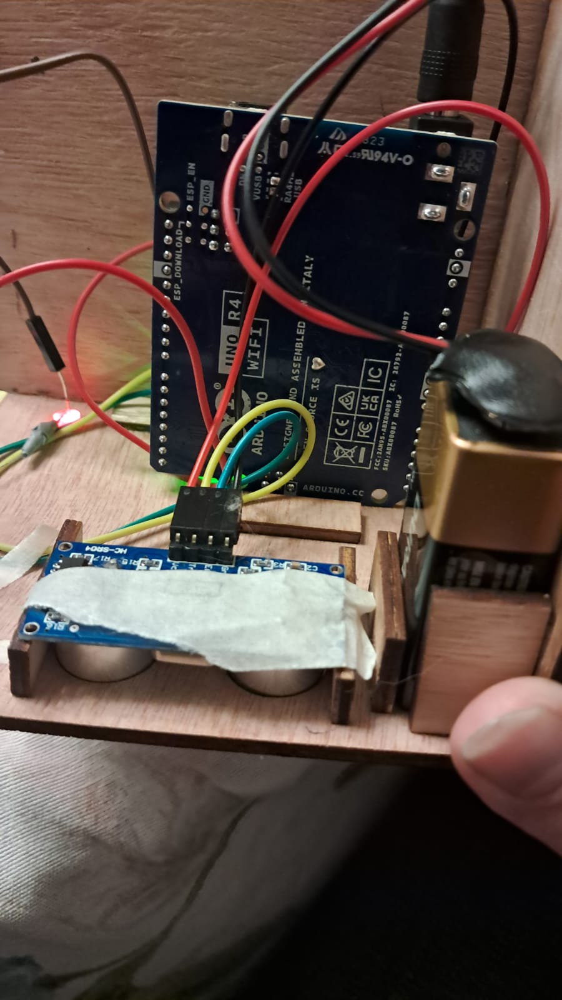
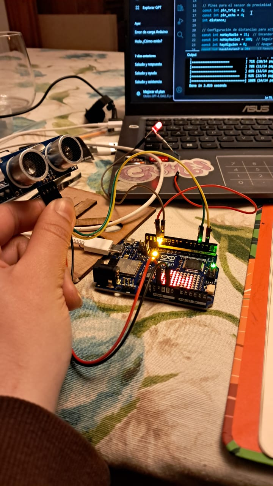
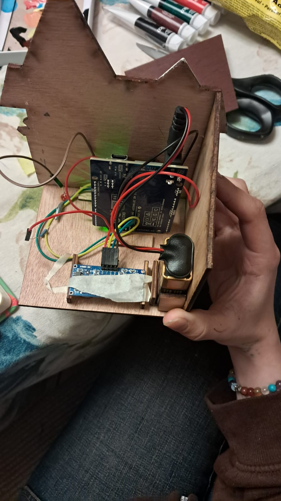
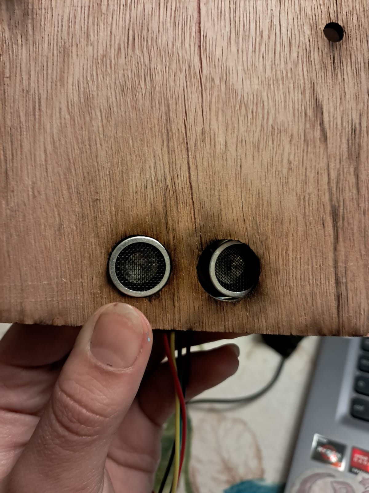
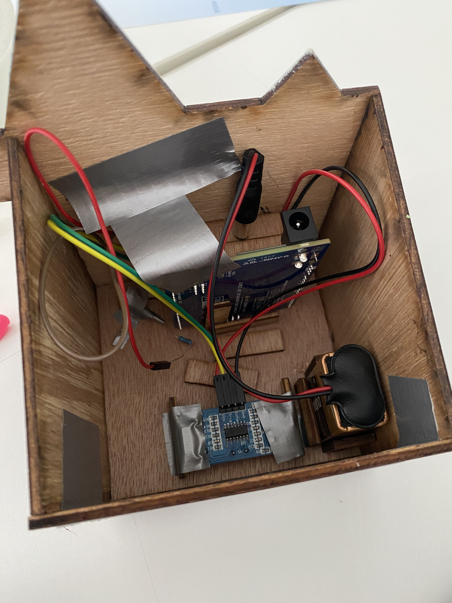
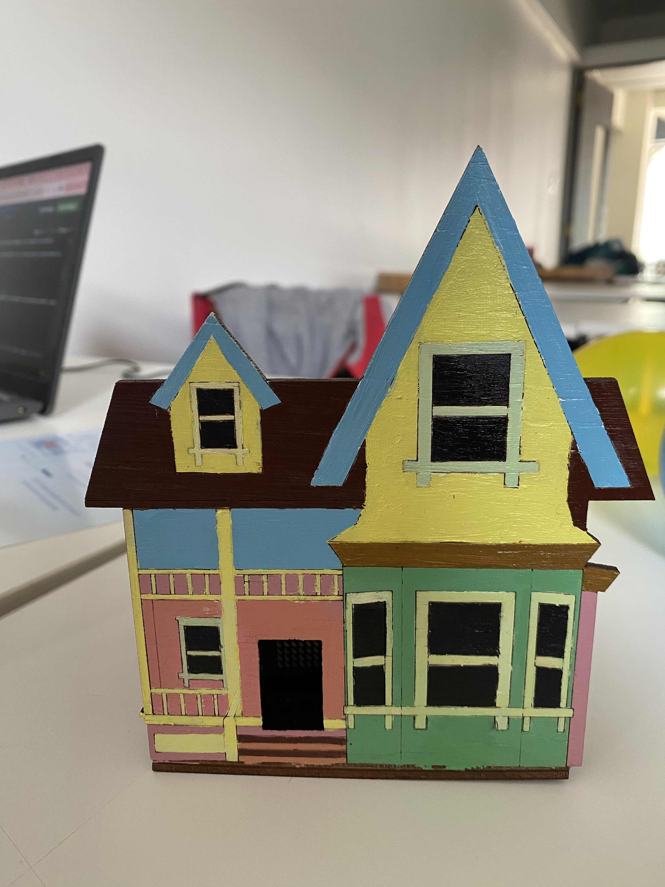

# clase-04

## primer plano casita


### Apuntes para mejorar 

definir bien como invitar a las personas a utilizar el objeto, podríamos poner una flecha para invitar a las personas a mirar por sobre la casa

quizás incluir los globos

quizás cambiar los colores de la casa para que sea más llamativa, dejar más en claro que es la casa de up


caso límite: caso extrémo que puede atentar con el funcionamiento que uno espera


### mejoras casita

incorporaremos el sensor en la base de la casa, junto con un led de color rojo para indicar al usuario a interacturar por ahí, además agregaremos globos en la parte superior para darle mas similitud a la casa original de up :)

## update:

añadimos un led rojo por debajo junto con el sensor, y el led se mantiene prendido cuando no detecta proximidad, junto con esto la matriz muestra la animación de un globo flotando en modo de espera. Cuando el sensor detecta proximidad se apaga el led y comienza la animación de la casita subiendo y bajando.

También pintamos la casita para que se viera aun más parecida a la origial


## que es y como es

es un juguete en forma de casa inspirado en la casa de UP, hecho con madera mdf y corte laser, y pintado para que tuviera aún mas similitud con la casa original. Funciona mediante un sensor ultrasónico, el cual si no detecta presencia mantiene prendido un led rojo y muestra la animación de un globo en modo de espera, y al detectar proximidad apaga el led y comienza la animación de la casa subiendo y bajando.

## primera casa 


en esta primera instancia teníamos en sensor en el techo de la casa, pero gracias a los feedback decidimos mover el sensor hacia abajo de la casa, pensando que esta estaría pegada en la pared, y junto con el led este invita al usuario a interactuar con la parte de abajo de la casa

## proceso 









https://github.com/user-attachments/assets/05678526-1e07-491c-b7fb-a0f040e43631


## casa actual






## diagrama de flujo 

tarea: Hacer funcionar la pantalla en la puerta de la casa. 


1. Asegurate de que la pantalla esté quieta mostrando la imagen de un globo y la luz led en la base de la casa esté encendida.
2. Para que la pantalla reaccione debes acercar tu mano a la base de la casa.
3. Una vez se apague la luz led en la base de la casa, la pantalla empezará a mostrar la animación de una casa que sube y baja.
4. Dependiendo de la distancia de tu mano con la base de la casa, la animación de la casa se muestra (si está a menos de 20cm) o la animación del globo junto con el led (si está a más de 20cm)


## codigo 

deje subido el archivo que usamos con el codigo de arduino :D 
adjunto links que nos ayudaron a entender que hacer 

https://www.profetolocka.com.ar/2024/07/29/tutorial-usando-la-matriz-led-del-arduino-uno-r4-parte-2/#google_vignette
https://naylampmechatronics.com/blog/10_tutorial-de-arduino-y-sensor-ultrasonico-hc-sr04.html
https://docs.arduino.cc/tutorials/uno-r4-wifi/r4-wifi-getting-started/

ademas de que use proyectos anteriores que hice el año pasado en tecnologias interactivas para acordarme de como usar el sensor y el led, deje el archivo subido tambien 🥣 
Me ayudó mucho que la Paula haya subido el link del código de su trabajo, además del link que compartió Aaron sobre como instalar las librerías y los comentarios de Belén y Karen. 

```c++

#include "Arduino_LED_Matrix.h"
#include "globito.h"
#include "animation.h"

ArduinoLEDMatrix Pantalla;

enum State {
  STANDBY,
  ACTIVO
};
// configuración del sensor
const int ledPin = 13;
const int pin_trig = 2;
const int pin_echo = 4;
int distance;

// Configuración de distancias para activar el LED
const int noHayNadie = 21;  // Encender el LED 13 desde los 21 cm
const int noHayNadie2 = 100; // Seguir encendido el LED hasta los 100 cm
const int hayAlguien = 20;  // Apagar el LED y comenzar la animación de la matriz desde los 20 cm
const int hayAlguien2 = 40; // Seguir encendida la pantalla hasta los 40 cm
// cuando no hay nadie esta prendido el led rojo y al detectar distancia se apaga

State currentState = STANDBY;

void setup() {
  Pantalla.begin();
  pinMode(pin_trig, OUTPUT);
  pinMode(pin_echo, INPUT);
  pinMode(ledPin, OUTPUT);

  Serial.begin(115200);
}

void loop() {
  readDistance();  // Leer la distancia del sensor

  switch (currentState) {
    case STANDBY:
      Serial.println("En estado STANDBY");

      if (distance >= noHayNadie && distance <= noHayNadie2) {
        digitalWrite(ledPin, HIGH);
        Pantalla.loadSequence(globito);
        Pantalla.play(true);
        currentState = STANDBY;
      } else {
        currentState = ACTIVO;
      }
      break;

    case ACTIVO:
      Serial.println("En estado ACTIVO");

      if (distance >= hayAlguien && distance <= hayAlguien2) {
        digitalWrite(ledPin, LOW);
        Pantalla.loadSequence(animation);
        Pantalla.play(true);
        currentState = ACTIVO;
      } else {
        currentState = STANDBY;
      }
      break;
  }
}

void readDistance() {
  // Enviar un pulso al pin TRIG
  digitalWrite(pin_trig, LOW);
  delayMicroseconds(2);
  digitalWrite(pin_trig, HIGH);
  delayMicroseconds(10);
  digitalWrite(pin_trig, LOW);

  long duration = pulseIn(pin_echo, HIGH);
  distance = duration * 0.034 / 2;  // Convertir a cm
}

```


