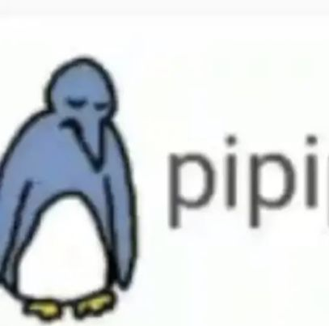

# clase-09

## fecha: 15 de Octubre

no fui 

bueno pero lo que me contaron que hicieron mi ekipo fue presentar nuestra idea para el proyecto de diseño abierto. Cómo aspectos a mejorar: nuestro discurso. Cómo es una idea que estaba muy en nuestra cabeza y que aún no teníamos muy claro como hacerlo nos enredamos un poquito, pero de a poco vamos mejorando eso.

## nuestro proyecto

Partimos con la idea de querer crear consciencia sobre como nuestros hábitos influyen al medio aambiente. Así que con eso decidimos investigar sobre la huella de carbono. Queríamos hacer una encuesta con preguntas que no sean tan explícitas, para que el usuario no sepa que esperarse y cambie sus respuestas. Al finalizar la encuesta mostraríamos los resultados en un espacio en realidad virtual, donde el usuario pudiese ver el gran impacto que tienen sus hábitos a largo plazo, y además mostrarle un espacio hecho con la recopilación de todas las respuestas.

