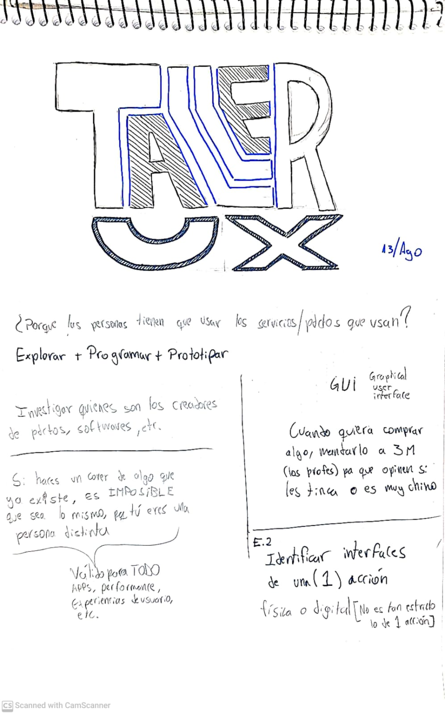

# clase-01

####introduccionAlTallerWeno

la clase fue escuchar muchas referencias y cosas

.

LINKS importantes

https://discord.com/channels/@me

https://www.figma.com/es-es/

https://github.com/clifford1one

-o--o--o--o--o--o--o--o--o--o--o-

Referencias clase 1:

a. Equipo docente:

https://www.instagram.com/luthierdiy/?hl=es

https://montoyamoraga.io

https://piruetas.xyz

https://andresmartinm.github.io/portafolioAnim2023/articulo.html?nro=2

https://github.com/AndresMartinM/AndresMartinM.github.io?tab=readme-ov-file

https://www.artstation.com/andresamartinm

https://www.youtube.com/@elmartin3553/videos

https://andresmartin.itch.io
