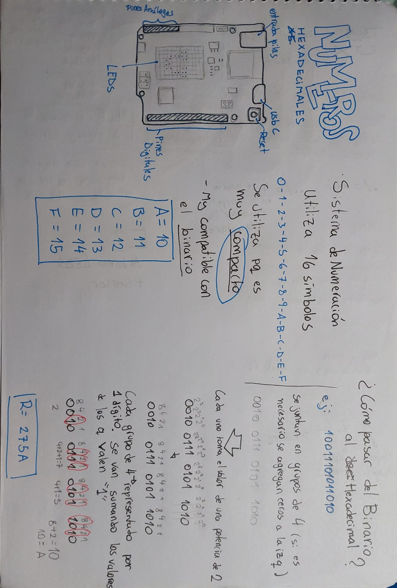

# clase-02
probando markdown

keep trying

## sensores

1. perilla
1. proximidad
1. crepuscular

AVANCES 1

1. Library Info
   
https://www.arduino.cc/reference/en/libraries/arduinographics/

3. Arduino Info
 
https://docs.arduino.cc/tutorials/uno-r4-wifi/led-matrix/

5. Animador
   
https://ledmatrix-editor.arduino.cc

7. Referentes
   
https://www.brandnewnoise.com/?srsltid=AfmBOoqQAkg8Tg3teeBfYOX00hCdlQ7wzG8Uae-5AN-V7CVNx_pu8LcM

https://www.brandnewnoise.com/products/looper-sound-recording-device-player-one?srsltid=AfmBOor7CKOkWEdJDzc5m_PNw9HonQXD6fruLH2EbojQtCtrmEDgjOo1

https://teenage.engineering/products/choir

https://www.youtube.com/watch?v=Ej18ALR0Dx0

https://www.youtube.com/watch?v=82LAlbSSgRY

9. Investigación
    
https://guitarhero.fandom.com/es/wiki/Guitar_Hero_Wiki:Guitar_Hero_Wiki

https://www.reddit.com/r/GuitarHero/

.

.
