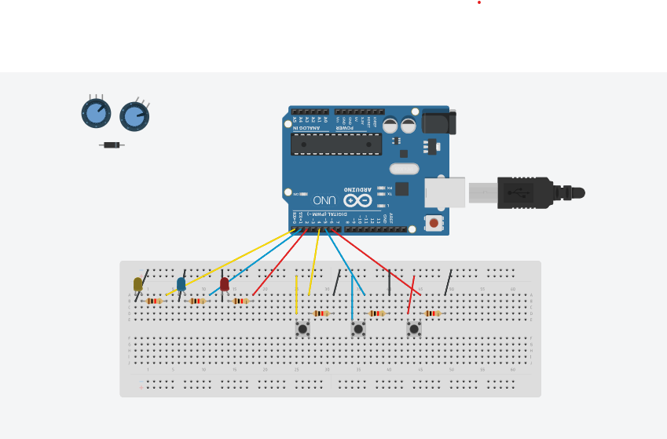
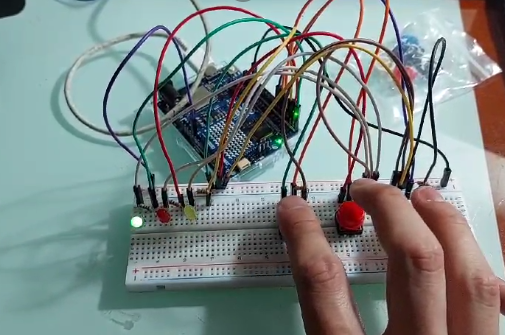
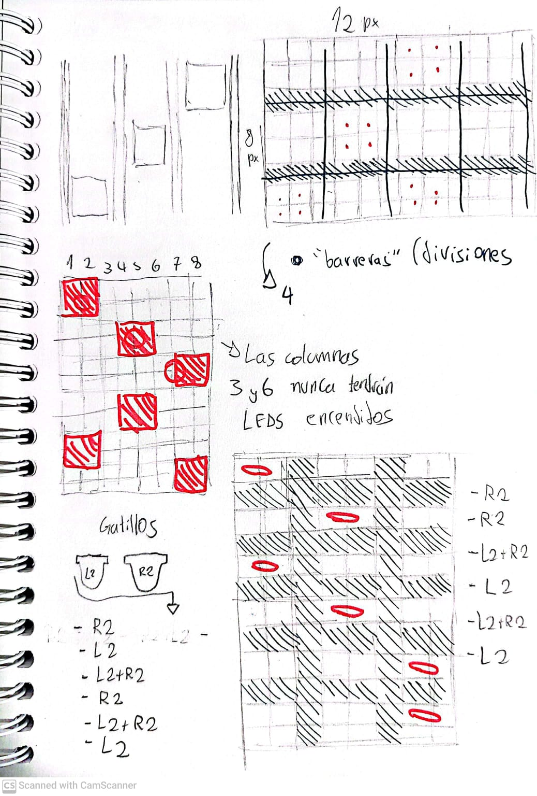

# clase-03
##Arduineación 1

Hoy comenzamos a definir lo conceptual y físico de nuestros objetos.

Propuesta: ¿Qué quiero pedirle al Arduino?

Explicación: Hay 3 casillas de las cuales 1 está "ON" y 2 están "OFF".

Cada casilla tiene un botón asociado. Al presionar un botón manda una señal a su respectiva casilla, la cual se apaga o enciende dependiendo de su estado anterior.

Una vez que se encuentrena apagadas todas las casillas, se pasa a la siguiente "etapa".

##AVACNCE 0.1.2

.

https://www.tinkercad.com/things/giOBoGTMZWH-exquisite-jaagub-gaaris/editel?sharecode=cyrerJqFRBJgO17nTo0HEt22Bv-Y0sGsiJkA3hiFBI0

.

#P R O G R E S O

.
