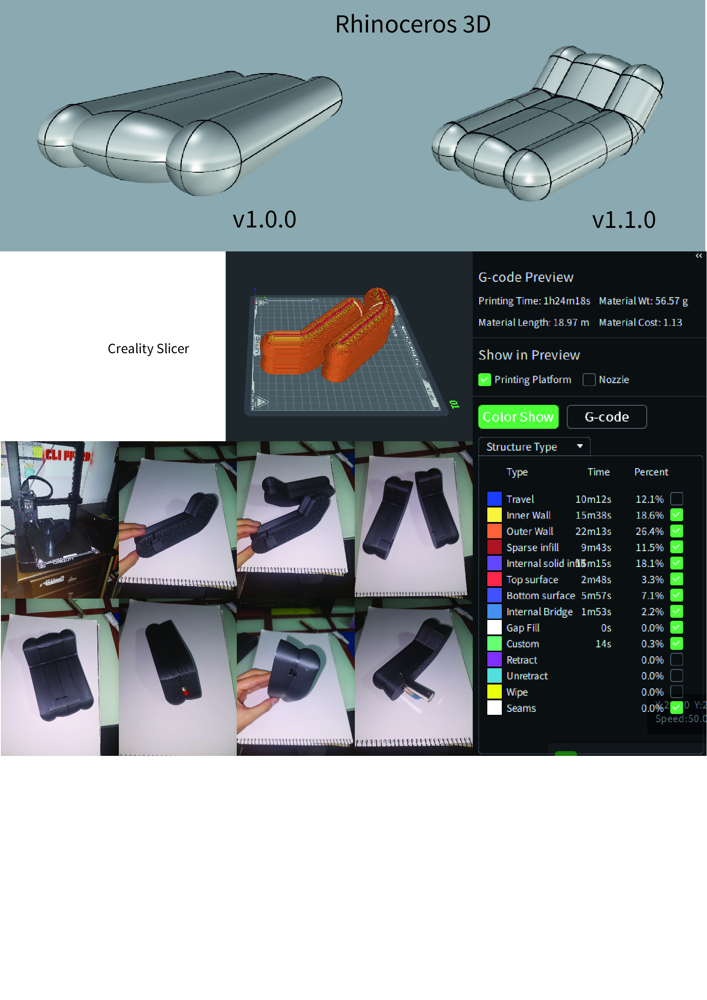
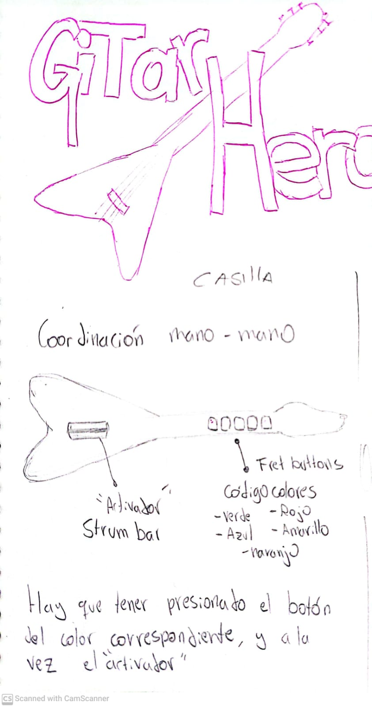
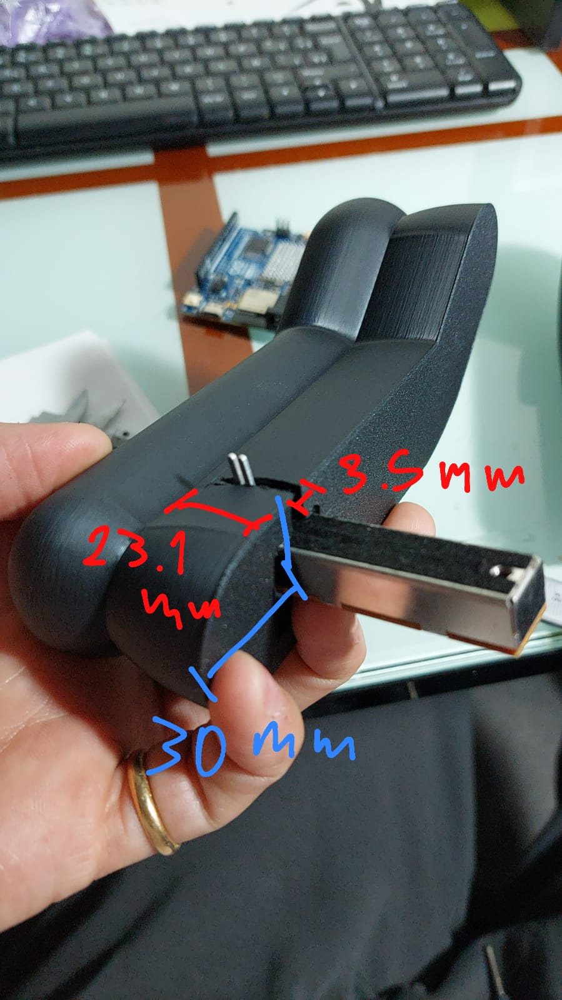
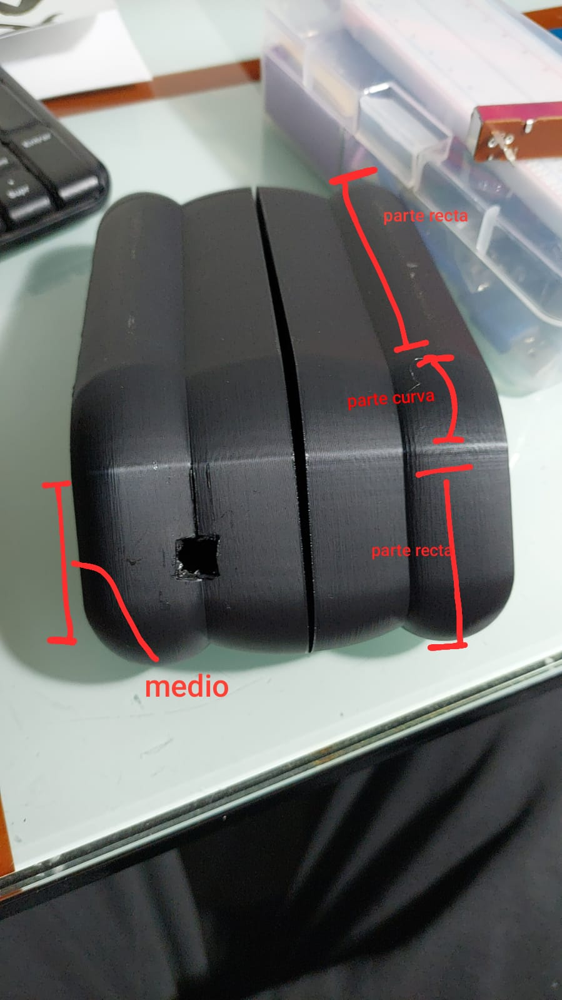
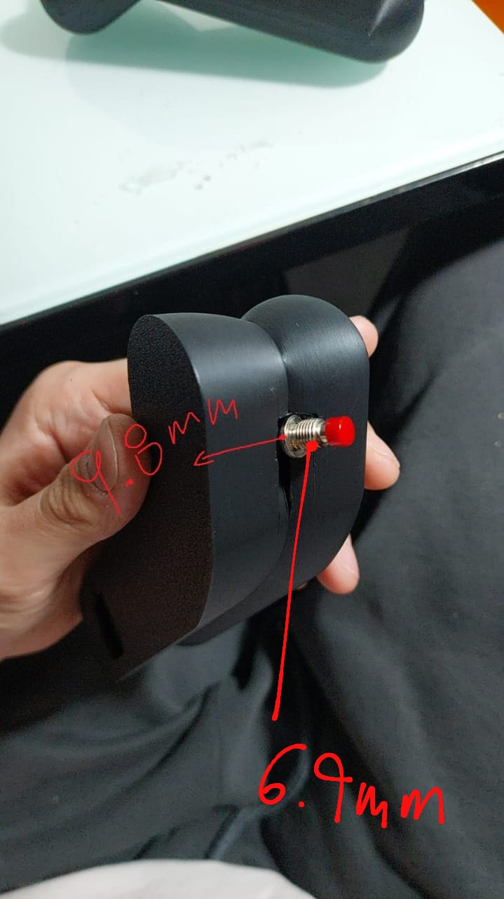
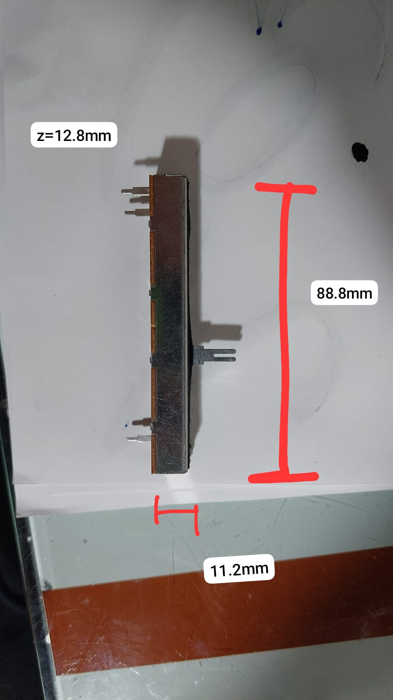
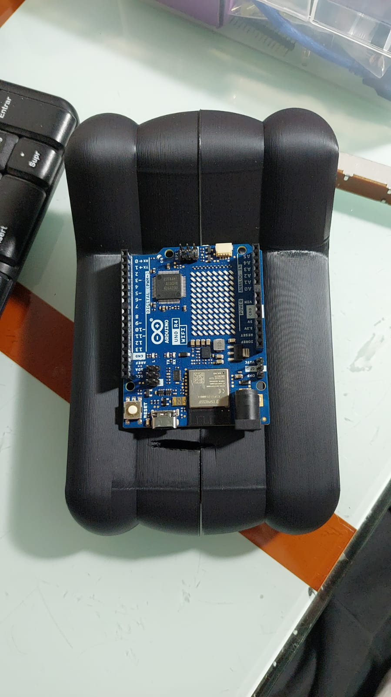

# clase-04

Presentamos el objeto:

#Feedback


1. Sensación Emocional
2. Lo bueno / Bien logrado
3. Lo malo / Poco claro
4. Referentes


I. Alanis.maria:
1. Sale de lo común
2. Ideación bien desarrollada, en cuanto la función
3. El tamaño


II. cata pinto:
1. Intrigante, no es algo común de vers y llama la atención su forma
2. Está bien pensado en cuanto a forma y angulación
3. siento que el tamaño es muy grande
4. no se me le ocurren referentes


III. morgan
1. Amo la forma, es como la cabeza de una guitarra :0000
2. amo como se hizo la ideación y la estructura esta muy interesante (enseñenme a usar rhino :333
3. No sabria como iria la pantalla y eso me confunde un poquito


IV. AbnerV
1. Me dan ganas de jugar.
2. Me encanta la forma curva  y la función de éste. 
3. Un poco más pequeño sería ideal


V. nori
1. creo que sorpresa y felicidad, me gusta mucho ver el proceso y que muestren tantas cosas, y me gusta mucho el guitar hero tambien 
2. me encanta que lo hayan hecho inspirado en el guitar hero, y la impresion se ve buena
3. no entendí como va a funcionar con botones o algo asi, y como se va a sostener el arduino en la impresión
4. aun no se me ocurren referentes :D


VI. paulita
1. vivo el objeto es muy ergonómico y tiene mucho movimiento 
2. el angulo del objeto me parece aporta mucho al juego hay super buena comprensión del referente 
3. me gustaría que implementaran de alguna forma un código de color como el que propone el juego en los gatillos
4. guitar hero para nintendo ds


VII. Karen
1. Emoción: “woaa” 
una forma extraña pero bacan!
2. Lo bueno: encuentro genial que se pueda 
sostener en las manos
3. Lo malo/poco claro: quizas falta pulir algunas partes 


VIII. T1ar3
1. Ya estoy emocionada de poder utilizarlo 
2. Destaco su forma y lo fácil de manipular 
3. Todavía no estoy muy clara como va la pantalla


IX. emjesus
1. me dan ganas de jugar
2. la forma está bien resuelta respecto al usuario, buen tamaño
3.  el color no me llama a jugar, usamos los pulgares? "descansan" en algún lado?


X. Sol Oyarce
1. Diferente, es distinto a las consolas comunes del mercado
2. El tamaño es adecuado para ambas manos 
3. La base esta un poco recta, se vería mejor un poco mas diagonal 
4. No tengo ningún referente que pueda aportar


XI. vale
1. objeto ergonómico, facil de usar
2. la forma es muy interesante, tiene coherencia con lo que comentan
3. ser mas cuidadosos con las terminaciones, quizas lijar.


XII. sofi olivares
me gusta la forma que le dieron, tiene mucho sentido a lo que quieren llegar
2. la forma es muy ergonómica y permite un buen uso del objeto, es comodo
3. la parte donde van los switch tiene unos bordes que molestan un poco a la hora de posicionar la mano


XIII. Belén🪼 
1. curiosidad
2. La forma está espectacular y el tamaño está muy bueno.
3. Eso si me lo imagino jugando más apoyado en una mesa
4. no tengo referente : (


XIV. juan pareschi. 
1. Interesado y emocionado, dado como resolvieron su proyecto y el tema que están trabajando
2. Se ve mucho avance y pensamiento detrás del objeto, rescato harto todo el detalle que se pudo ver del proceso y la multifuncionalidad del modulo actual
3. Falta definir mas claro como se interactua con el objeto (es estacionario o no, como  con el código los inputs), redefinir el input del carril del medio (al funcionar con los 2 botones, puede haber problemas de que el código lea bien los inputs por lo mismo)
4. Juegos de arcade de ritmo (buscar Pop'n'Music, Taiko no Tatsujin o japanese rhythm games arcade en google) o controles de juego en general, pensar sobre todo como el usuario toma e interactúa con el objeto


# ¿QUÉ ES HEROE GUITARRA?
Heroe Guitarra es un dispositivo electrónico inspirado en el modo de uso mas común de un instrumento: un acorde accionable y una pulsación. HEROE GUITARRA tiene 3 carriles en donde están posicionados los acordes que deberemos accionar, éstos acordes estarán repartidos aleatoriamente.


.

El modelo avanzó hacia una morfología más ergonómica, la cual permite un mejor agarre gracias a su tamaño disminuido respecto a la versión anterior.

Imprimí este prototpo de la forma para comprobar su comodidad y tamaño. Posteriormente utilicé un cuchillo cartonero, el cual calenté usando una mecha, para perforar el prototipo y ver en qué partes podrían ir los componentes. 

El objeto final se compondrá de:
-Carcasa impresa en 3D
-Arduino UNO r4 wifi

https://github.com/user-attachments/assets/3c2b996b-d719-445b-8d6c-a8064b78f642


-Pushbutton(x2)
-Potenciómetro deslizante


Los cambios realizados responden a la nueva mecánica del juego. La versión actual del juego (v1.1.0) consiste en una mecánica de coordinación entre ambas manos. (como en el guitar hero original) Además, con la nueva morfología de heroeGuitarra se ahorra es materiales, costos, y tiempo de fabricación.


.

En el caso de Heroe Guitarra 1.1.0 el "strum bar" y los "fret buttons" son emulados por el potenciómetro y pushbutton respectivamente. De esta forma, el usuario, con el dedo pulgar de una mano debe seleccionar el carril donde se ejecutará la acción(con el potenciómetro) y con el dedo índice de la otra mano deberá ejecutar la acción(con el pushbutton). 

Estos cambios fueron inspirados por los comentarios e ideas de Paula y Juan (pixelitaa y starbrowser).

.
Medidas de la renura por la cual se asome la "perilla" del potenciómetro


.
Medida de donde va el pushbutton. (Si se traza una linea vertical desde donde termine la curva hasta efinal del objeto, es justo al medio)


.
Medidas grosores pushbutton


.
Medidas potenciómetro slicer(comprado en MCI electronics a 5.290 CLP
https://mcielectronics.cl/shop/product/potenciometro-lineal-de-10kohm-10242/


.
Imagen explicativa de donde iria el arduino, y la pantalla.

MÁS AVANCES

https://roboticsbackend.com/arduino-control-led-brightness-with-a-potentiometer/
Con ayuda de este ejemplo, aprendí como se usa el potenciómetro.

https://roboticsbackend.com/arduino-potentiometer-with-multiple-leds-tutorial/#:~:text=To%20select%20the%20LED%2C%20you,2%2C%20and%20then%20all%20LEDs.
Con ayuda de este ejemplo, aprendí cómo, con el potenciómetro, seleccionar diferentes LEDs dependiendo del valor del pot.


Estos links me ayudaron a entender como relaciona la pantalla con los componentes, y cómo hacer que una animación sea interactuable
https://www.instructables.com/Arduino-LCD-Game/
https://www.youtube.com/watch?v=TURzbXTNaA0
https://www.youtube.com/shorts/ssNbqmXvPnQ

Este documento me ayudó a entender la relación entre los pixeles y el lenguaje binario.
https://docs.arduino.cc/tutorials/uno-r4-wifi/led-matrix/

Utilicé este editor para hacer los frames.
https://ledmatrix-editor.arduino.cc

Estos links me ayudaron a entender la sintaxis del código.
https://www.arduino.cc/reference/es/language/functions/digital-io/pinmode/
https://www.w3schools.com/js/js_if_else.asp


##DEFINICIÓN
Guitarra Héroe consiste en un juego de un jugaro que se juega con ambas manos. En pantalla se muestran 3 carriles, con el potenciómetro debes apuntar y seleccionar el carril que tenga una casilla encendida mas cercana al señalizador. Una vez seleccionada se debe usar el gatillo para ejecutar la acción, de esta forma "apagar" la casilla, y poder pasar a la siguiente etapa.

#CÓDIGO
Fue un proceso bastante complicado, el cual se compuso por varias fases, en las que iba aprendiendo distintas cosas del funcionamiento general, tanto de los botones como del arduino, y sus actuadores y sensores.

¿Cómo se usa?
Se utiliza con ambas manos, con una mano debes utilizar el potenciómetro para seleccionar el carril donde quieres ejecutar la acción, mientras que simultáneamente, con el dedo índice de la otra mano debes utilizar el gatillo para ejecutar la acción misma. Debes ir ejecutando acciones en el carril correspondiente de abajo a arriba, de modo que los LEDs se apagen, hasta haber completado la pantalla. 


```ino 
int ledPin = 11;
int potPin = A1;

void setup() {
  // put your setup code here, to run once:
pinMode (ledPin, OUTPUT);
}
/*Aquí definí que el LED está en modo "recibo info", el potenciómetro no lo defino, porque automáticamente viene en modo "doi info" */


void loop() {
  // put your main code here, to run repeatedly:

int potValue = analogRead(potPin);
/* Aquí, entiendo que significa que: defino una nueva variable, llamada potValue, y esta variable va a leer al potenciómetro(potPin), y "acordarse" de el valor que lea*/

int brillo   = map(potValue, 0, 1023, 0, 255);
/*El potenciómetro funciona con valores de 10 bits(0-1023), pero al usar la variable "Analog.Write, ésta lee valores de 1 byte(0-255). La variablec"map" me permite transformar estos valores proporcionalmente. Aquí le estoy diciendo que una varibale "brillo" almacenará valores , y que la variable map los escala.*/

analogWrite(ledPin, brillo);
}
```
En el código anterior aprendí cómo usar un potenciómetro, y como cambiar el brillo de los pines con él.


``` ino
#define LED_1_PIN 11
#define LED_2_PIN 10
#define LED_3_PIN 9
#define POTENTIOMETER_PIN A0

#define LED_NUMBER 3

void setup()
{
  pinMode(LED_1_PIN, OUTPUT);
  pinMode(LED_2_PIN, OUTPUT);
  pinMode(LED_3_PIN, OUTPUT);
}

void loop()
{
  int potentiometerValue = analogRead(POTENTIOMETER_PIN);
  int ledChoice = potentiometerValue / (1024 / LED_NUMBER);
  
  if (ledChoice > LED_NUMBER - 1) {
    ledChoice = LED_NUMBER - 1;
  }
  
  if (ledChoice == 0) {
    digitalWrite(LED_1_PIN, HIGH);
    digitalWrite(LED_2_PIN, LOW);
    digitalWrite(LED_3_PIN, LOW);
  }
  else if (ledChoice == 1) {
    digitalWrite(LED_1_PIN, LOW);
    digitalWrite(LED_2_PIN, HIGH);
    digitalWrite(LED_3_PIN, LOW);
  }
  else {
    digitalWrite(LED_1_PIN, LOW);
    digitalWrite(LED_2_PIN, LOW);
    digitalWrite(LED_3_PIN, HIGH);
  }
}
```
En el código anterior seguí con el proceso de entender cómo funcion un potenciómetro, esta vez, lo utilicé para alternar entre qué LEDs están encendidos.


```ino
/*
  Play Animation

  Sketch shows animation defined in animation.h

  See the full documentation here:
  https://docs.arduino.cc/tutorials/uno-r4-wifi/led-matrix
*/


#include "Arduino_LED_Matrix.h"   //Include the LED_Matrix library
#include "animation.h"            //Include animation.h header file


// Create an instance of the ArduinoLEDMatrix class
ArduinoLEDMatrix matrix;  

void setup() {
  Serial.begin(115200);
  // you can also load frames at runtime, without stopping the refresh
  matrix.loadSequence(KKK);
  matrix.begin();
  // turn on autoscroll to avoid calling next() to show the next frame; the paramenter is in milliseconds
  // matrix.autoscroll(300);
  matrix.play(true);
}

void loop() {
  delay(500);
  Serial.println(millis());
}
const uint32_t KKK[][4] = {
	{
		0x8108100,
		0x122b22b0,
		0x1801801,
		66
	},
	{
		0x8308300,
		0x12292290,
		0x1801801,
		66
	},
	{
		0x8108100,
		0x12292290,
		0x1803803,
		66
	}
};
```
En el código anterior se presenta el primer avance importante respecto al uso del display de la plca Arduino UNO r4 Wifi. En este caso, se ejecuta una animación, la cual corre en loop.  


```ino
/*
  Single Frame
  
  Displays single frames using matrix.loadFrame
  
  See the full documentation here:
  https://docs.arduino.cc/tutorials/uno-r4-wifi/led-matrix
*/

#include "Arduino_LED_Matrix.h"  // Include the LED_Matrix library
#include "framesv2.h"              // Include a header file containing some custom icons
int potPin = A0;
ArduinoLEDMatrix matrix;  // Create an instance of the ArduinoLEDMatrix class
int botonWeno = 2;
int botonValue;

void setup() {
  Serial.begin(115200);  // Initialize serial communication at a baud rate of 115200
  matrix.begin();        // Initialize the LED matrix
  pinMode(botonWeno, INPUT);

}

void loop() {

  int potValue = analogRead(potPin);
  // Load and display the "chip" frame on the LED matrix

  int carril = map(potValue, 0, 1023, 0, 2);

  if (potValue > 140 && potValue < 401) {
    matrix.loadFrame(ogIzq);

  }

  // Load and display the "danger" frame on the LED matrix
  else if (potValue > 400 && potValue < 639) {
    matrix.loadFrame(ogMed);
  }

  // Load and display the "happy" frame on the LED matrix
  else if (potValue > 638 && potValue < 890) {
    matrix.loadFrame(ogDer);

  }

int botonValue = digitalRead(botonWeno);

 if(botonWeno == HIGH) {
   matrix.loadFrame(finFase1);
}

}
```
En este còdigo, con el slider puedo seleccionar el carril. El paso siguiente es que al apretar el boton en el carril ocrrecto, se apague el led.

 ```ino
 int pulsadorPin = 4; // Variable que guarda el número del pin al que conectamos el pulsador.
int valorPulsador = 0; // Variable donde almacenaremos la lectura del estado del pulsador.
 
void setup() {
  Serial.begin(9600); // Inicializamos el puerto serie.
  pinMode(pulsadorPin, INPUT_PULLUP); // Declaramos la variable inputPin como entrada y activamos su resistencia interna Pullup.
}
 
void loop(){
  valorPulsador = digitalRead(pulsadorPin);  // Lectura digital de pulsadorPin
 
  if (valorPulsador == HIGH) {
      Serial.println("Pulsado"); // Si detecta que pulsamos el pulsador imprime por el monitor serie "pulsado".
  }
  else {
      Serial.println("No pulsado"); // En caso contrario imprime por el monitor serie "No pulsado".
  }
  delay(1000); // Espera un segundo al final del bucle
}	

```
Como no lograba hacer funcionar el pulsador, utilicé este código aislado, que utiliza el serial.println para avisar qué se está detectando del botón. Al  hacer esto pude comprobar que el botón no funcionaba como debería, por lo que decidimos descartar su uso en el código final 


 ##CÓDIGO FINAL

 ```INO
/*
  Single Frame
  
  Displays single frames using matrix.loadFrame
  
  See the full documentation here:
  https://docs.arduino.cc/tutorials/uno-r4-wifi/led-matrix
*/

#include "Arduino_LED_Matrix.h"  // Incluye the LED_Matrix library
#include "framesv2.h"            // Incluye el archivo con los códigos de los frames en lenguaje hexadecimal

int potPin = A0; //declaro que el pin del potenciómetro es el "A0"
ArduinoLEDMatrix matrix;  // Create an instance of the ArduinoLEDMatrix class
//int botonWeno = 2; Originalmente declaraba el pin del pulsador

bool ogDerSeen = false; //Variable que utilizaré como "flag", que sirve para indicar que una vez que se haya cumplido cierta condición, el código se ejecute a partir de cierta línea
//bool fase2Seen = false;  //Ésta era otra flag, utilizada para una fase mas avanzada del juego(por temas de tiempo fue descartada.

void setup() {
  Serial.begin(9600);  // Se inicializa la comunicación
  matrix.begin();      // Se inicializa la matriz LED 
}

void loop() {

  int potValue = analogRead(potPin); // Acá le pido que, lea el valor(potValue) desde el pin del potenciómetro(potPin).

  int carril = map(potValue, 0, 1023, 0, 255); //Ésta línea sirve para hacer una conversión proporcional entre los valores emitidos por el potenciómetro, y los valores leídos por el pin análogo

  if (ogDerSeen == false) {   //Declaro que, si, el frame "ogDerSeen" no ha sido mostrado, pasa lo siguiente
    if (potValue > 140 && potValue < 401) {  
      matrix.loadFrame(ogIzq);
    }  //Declaro que, si, el valor del potenciómetro está entre 142 y 400, muestre el frame "ogIzq".

    // Load and display the "danger" frame on the LED matrix
    else if (potValue > 400 && potValue < 639) {
      matrix.loadFrame(ogMed);
    }  //Declaro que, si, el valor del potenciómetro está entre 401 y 638, muestre el frame "ogMed".

    else if (potValue > 638 && potValue < 890) {
      matrix.loadFrame(ogDer);
     ogDerSeen = true;//aca declaro la variable "ogDerSeen" como HIGH, para usarlo como referencia de la fase.

    }  //Declaro que, si, el valor del potenciómetro está entre 639 y 889, muestre el frame "ogDer".
  }


//FASE 2, esto es marcado por la flag "ogDerSeen".
if(ogDerSeen == true) { //Declaro que, si, la variable "ogDerSeen" está HIGH, el código corre a partir de aquí.
    // Load and display the "danger" frame on the LED matrix
    if (potValue  > 638 && potValue < 890) {
      matrix.loadFrame(ogDer);
    }  //aca le pido que si el valor esta entre 400 y 639, se "coloque" en el carril del medio

  else if (potValue > 400 && potValue < 639) {
      matrix.loadFrame(fase2);
      //fase2Seen = true;
  }

  else if (potValue > 140 && potValue < 401) {
      matrix.loadFrame(faseExp);
      //fase2Seen = true;
    } 
/*
if(fase2Seen == true) {
    if (potValue > 140 && potValue < 401) {
      matrix.loadFrame(fase3);
    }
    else if(potValue > 400 && potValue < 639){
     matrix.loadFrame(fase4);
  }
  else if(potValue > 638 && potValue < 890){
     matrix.loadFrame(fase5);
}
}*/ //Este es un intento por crear más faces que alarguen la duración del juego. Sin embargo por limitaciones de tiempo no se pudo implementar correctamente.
}
}


/*if (potValue > 638 && potValue < 890 && botonValue == HIGH) {

    matrix.loadFrame(finFase1);
  }  // aca quiero pedirle que si està en el carril derecho(es decir, que el valor del pot sea entre 638 y 890) y que si el botòn es pulsado, que muestre otro frame
}
*/ //Aquí se encuentra un intento por incluir el botón dentro de las mecanicas del juego. FInalmente no pudo ser implementado.

 ```
En este código se optó por un camino alternativo, debido a que la idea original no se pudo implementar de la manera en que se pensó. La opción del botón se reemplazó por seleccionar el carril con el potenciómetro, y una vez se selecciona el carril correcto se pasa a la siguiente etapa.


https://github.com/user-attachments/assets/9a323fd2-9ae7-4eef-9f57-42030352ce57


##COLABORACIÓN

Agradecemos feacientemente los comentarios de todes del curso que nos escribieron feedback, especialmente a aquellos que nos recomendaron referentes. 

Queremos volver a mencionar las oportunas ideas y feedback que nos brindaron Paula y Juan, cuyos comentarios nos ayudaron a guiar el proyecto por buen camino.

Mención honrrosa al grupo de trabajo que formamos el día lunes 9 de septiembre. El cual consistió en una colaboración constante y conversaciones enriquecedoras: 
Alanis, Belén, Emilia, Morgan, Sofía, Tiare.
