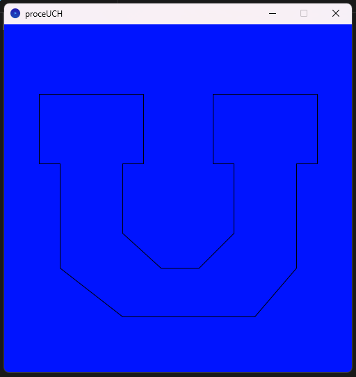

### clase-13

## preClase 13

Bibliografía

http://johnnylee.net/projects/wii/ (Este proyecto es muy impresionante)

https://www.reddit.com/r/DolphinEmulator/comments/nt2px8/wii_remote_to_pc/?rdt=58163

Entre ayer y hoy he tenido un arduo recorrido en el camino de conectar el Wiimote a mi notebook.

Éstos los videos que ví para lograrlo.

https://www.youtube.com/watch?v=J-s9gZJNp8o

https://www.youtube.com/watch?v=K5_MN7vahzw

https://www.youtube.com/watch?v=sFmATNHuWJk

https://www.youtube.com/watch?v=IZPdlzp-P5g

El método tradicional(conectarlo por bluetooth) no funcionó, así que comenzó mi proceso de encontrar soluciones


https://emulation.gametechwiki.com/index.php/Wii_emulators

éste link es sumamente importante. Es una wiki sobre todos los emuladores actuales de todas las consolas, incluye actualizaciones sobre los más usados y confiables y los links originales para descargarlos.

#### Tutoriales que fueron útiles

https://www.instructables.com/How-to-Use-Your-Wii-Remote-on-Your-PC-As-a-Game-Co/

El siguiente link fue el salvador del proyecto. En él cuentan que muchas veces los drivers de bluetooth se ponen mañosos, y siguiendo el tutorial desinstalé los drivers del notebook(de ahora en adelante referido como "MARSELO") y éstos se reinstalan automáticamente al reiniciar el compu.

https://answers.microsoft.com/en-us/windows/forum/all/how-to-connect-wii-remote-to-windows-11/20d5b074-73d8-4a79-871f-37831d7cbc42

Estoy usando el emulador dolphin para probar el funcionamiento del Wiimote

https://es.dolphin-emu.org/download/?cr=es

Descargue éste driver para lograr la conexión. -->

https://www.julianloehr.de/educational-work/hid-wiimote/

Actualmente (7/11/2024) ya logré conectar el wiimote a MARSELO. EL siguiente paso es encontrar una página confiable de dónde descargar ROMS de juegos de wii, para poder probar el funcionamiento del wiimote


## Processing

En mi camino por aprender processing comencé a experimentar con las líneas, e intenté crear un logo con ellas.

```java

size (500, 500);
background (0, 20, 255);

line(50, 100, 200, 100);
//linea horizontal de más arriba a la izquierda nombreClave: techoIzq
line(50, 100, 50, 200);
//conecta con techoIzq en la izq
line(200, 100, 200, 200);
//conecta cn techoIzq en la der
line(50, 200, 80, 200);
//linea corta por la izq
line(170, 200, 200, 200);
//línea corta por la derexa
line(80, 200, 80, 350);
//línea larga vertical por la izq
line(170, 200, 170, 300);
//línea larga vertical por la der
line(80, 350, 170, 420);
//línea diagonal larga
line(170, 300, 225, 350);
//línea diagonal corta


line(300, 100, 450, 100);
//linea horizontal de más arriba a la derecha nombreClave: techoDer
line(300, 100, 300, 200);
//conecta con techoDer por la izq
line(450, 100, 450, 200);
//conecta con techoDer por la der
line(300, 200, 330, 200);
//linea corta por la izq
line(450, 200, 420, 200);
//linea corta por la der
line(330, 200, 330, 300);
//linea larga vertical por la izq
line(420, 200, 420, 350);
//linea vertical larga por la der
line(330, 300, 280, 350); 
//linea diagonal corta
line(420, 350, 360, 420);
//linea diagonal larga

//ahora pondré las lineas horizontales de abajo
line(360, 420, 170, 420);
//linea horizontal larga
line(225, 350, 280, 350);
```
El código anterior me tomó aprox 40 minutos y logré este resultado.

.


Después de eso copíe un par de ejemplos de la página de processing para seguir familiarizándome con el entorno de programación.

https://processing.org/examples/

Actualmente estoy viendo los tutoriales de Daniel Shiffman

https://www.youtube.com/playlist?list=PLzJbM9-DyOZyMZzVda3HaWviHqfPiYN7e

## 0.6 Overview of Topics

https://www.youtube.com/watch?v=XNgfxOUoJ4g&list=PLzJbM9-DyOZyMZzVda3HaWviHqfPiYN7e&index=10

Anotaciones del video

### Fundamentals:

Data: Information storaged on the computer. 

- Variable: Is where the data is storaged
  
- Array: A list of data

Control: 

- Conditional logic(if/else statements)

- Loop: Repetition to save in code "ahorrar"

Organization:

- Functions: contains instructions to do certain thing.

- Objects:  objects has data/functionalities associated with them.


----

line(x, y, x1, y1);
lo que está dentro del paréntesis se le llaman "arguments". "line" sería un "functionName"

### Rectágunlos

hay varias formas de dibujar un rectágunlo en processing, la forma predeterminada es: (x, y, width, height)

donde (y, y) son las coordenadas de la esquina superior izquierda. Y (width, height) es el ancho y alto en pixeles del rectángulo completo.

https://processing.org/reference/rect_.html


la función rect() te permite crear un recatngulo de cualquier tamaño y redondear sus esquinas por serparado o todas juntas, sin embargo, siempre tendrás que crear el rectangulo a partir de su esquina superior izquierda.

Con la función rectMode() puedes crearlo desde su centro, o cualquiera de sus esquinas

https://processing.org/reference/rectMode_.html

la sintaxis para estos casos es:

rectMode(CENTER)
rect(x, y, w, h);

### Elípse

https://processing.org/reference/ellipse_.html

sintaxis: ellipse(x, y, w, h); 

en este caso (x, y) refieren al centro de la elipse. (de igual manera se puede cambiar con ellipseMode()

https://processing.org/reference/ellipseMode_.html

### Colores 

fill()

stroke()

son los conceptos básicos para el color. Funcionan en formato rgb.


Se escribe el color para la siguiente forma que se hará. Se escribe primero la data de color, y dps la forma. Entonces, si pongo un color alprincipio, funcionará para todas las formas a continuación, amenos que especifique un nuevo color.


Los colores se pueden describir de muchas formas en pde, pero la forma predeterminada es (r, g, b);


Para poner blanco, negro, o valores en escala de grises, basta con poner 1 digito: (0); para negro. (255); para blanco(y no es necesario poner (255, 255, 255);) 


Si pones un "#" se puede poner el color en hex.


