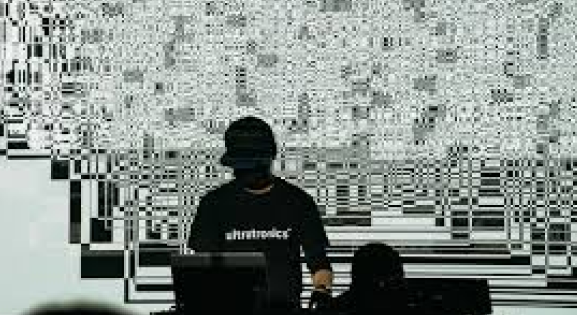
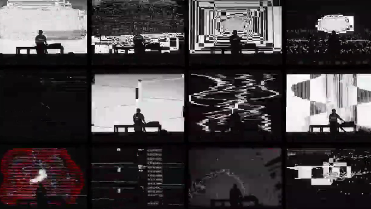
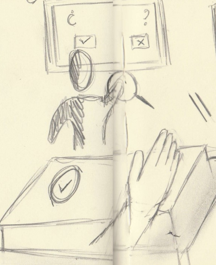
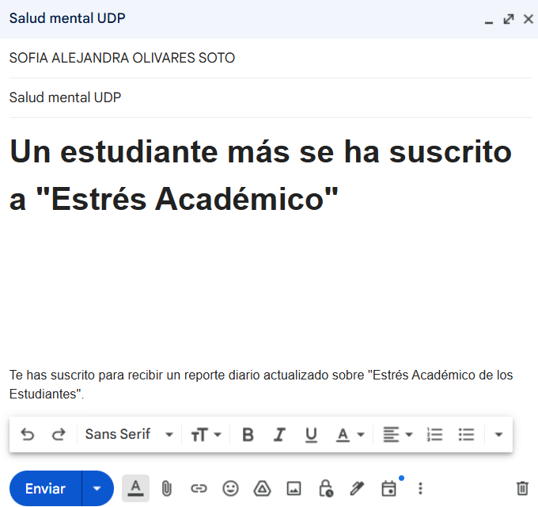
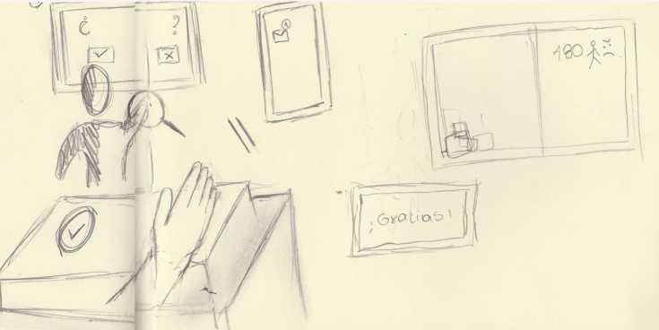
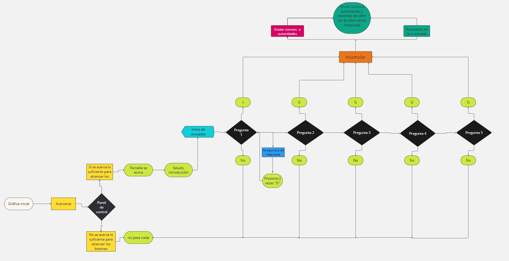
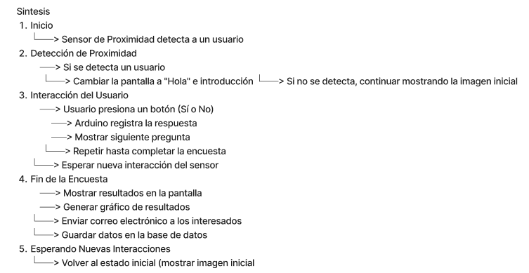
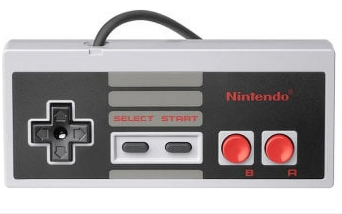
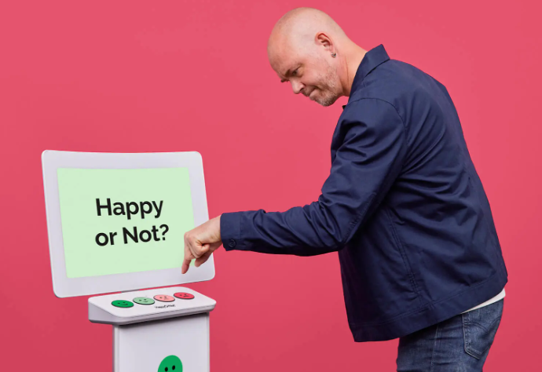
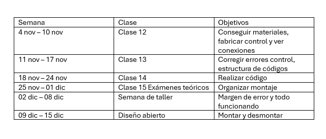

## clase-11

# Temática y contextualización a nivel nacional
Nuestro proyecto aborda el estrés de la carga acádemica y como este afecta la vida de les alumnes. 
Estudio del año 2018 en Chile, realizado por la Universidad Andrés Bello y la Universidad de las Américas, reveló que una proporción significativa de estudiantes universitarios presenta síntomas de estrés y otros problemas de salud mental como la ansiedad y la depresión. Según la investigación, el 57% de los estudiantes reportó haber experimentado estrés académico, una cifra elevada que destaca las dificultades y demandas emocionales a las que se enfrentan en sus entornos académicos. Además, más de el 10% dentro del porcentaje de estudiantes estresados, han dicho querer suicidarse debido a tanta carga y la falta de atención de salud psicologica para poder afrontar de mejor manera estas situaciones.

# Descripción de proyecto
Nuestro objetivo es visibilizar ante las autoridades de la Escuela de Diseño de la Universidad Diego Portales sobre el impacto del estrés derivado de la carga académica en sus estudiantes. A través de este proyecto, buscamos crear un espacio donde los estudiantes puedan expresar su experiencia, comprendan que no están solos en estos desafíos y visibilicen esta problemática de manera colectiva y efectiva.

A través de una recopilación de datos interactiva basada en un sistema de votación sencilla, que permitirá medir y visualizar el nivel de estrés que genera la carga académica, acumulado en los estudiantes en tiempo real. 

### Etapa 1: Introducción visual con la gráfica de Ikeda: 
Al iniciar la interacción, se mostrará una pantalla con la Gráfica de Ikeda, que no solo captará la atención del usuario, sino que ofrecerá una representación simbólica de los efectos del estrés en el cerebro humano. La gráfica se utilizará para ilustrar cómo el estrés académico, la ansiedad y la tensión afectan a los estudiantes, resaltando visualmente el peso de estas presiones. 

 
Por qué ocupar la gráfica de ikeda 
- Uso de datos para crear experiencias inmersivas.
- El público se convierte parte de la obra.
- Estética minimalista.
- visualización de datos como arte.
- Busca hacer una excavación profunda en la creación de sonidos mediante algoritmos. 

Su gráfica hace uso de datos en tiempo real, la utilización de su gráfica nos ayudará a llamar la atención de una manera más innovadora y que las personas hagan consciencia de su estrés de una manera distinta.

### Etapa 2: Cuestionario Interactivo y gráfica
Luego se mostrará en pantalla un saludo y una breve introducción para contextualizar al usuario

https://github.com/user-attachments/assets/03bd115b-6f58-4f24-b967-583f12f1b5a7

Para luego seguir con las preguntas de este cuestionario que están diseñadas para reflejar distintas dimensiones del estrés que provoca la carga académica, tales como:
- Dificultad para gestionar el tiempo.
- Conflictos entre los estudios y la vida personal.
- Presión por alcanzar metas y expectativas personales.
- Falta de empatía de los académicos respecto a la misma carga de trabajo.
  
Las preguntas utilizadas serán 5 y se relacionan estrictamente con indicadores de estrés elevados, ya que todas estás situaciones que presentamos ayudan a establecer una conexión directa que genera el estrés académico, ya que son situaciones que genera síntomas emocionales que son parte del estrés, como ansiedad, frustración, cansancio, insomnio. procrastinación, etc.
ejemplo concreto de preguntas: 
- ¿Crees que necesitas más tiempo para cumplir con tus proyectos?
- ¿Te resulta difícil balancear tus estudios con actividades personales?
- ¿Te sientes presionado/a por cumplir con fechas límite?
- ¿Has sentido alguna vez que no puedes alcanzar tus propias expectativas en los Exámenes, solemnes etc?
- ¿Has notado que te sientes más cansado/a de lo normal después de preparar el exámen para D.A?

Situaciones que genera estrés a les estudiantes por la gran carga académica.

Las preguntas se presentarán en una pantalla de forma simple y clara, y se responderán con un control que tendrá solo dos botones: “Sí” o “No”. Les estudiantes deben presionar el botón que mejor refleje su situación, permitiéndonos recopilar datos anónimos de manera directa y accesible. 

Dibujo técnico de panel con dos botones de arcade tamaño jumbo

 

### Etapa 3: Visualización de Estrés Acumulado

Pantalla ubicada en la exposición

Cada vez que un estudiante responda “Sí” a una pregunta, el nivel de estrés acumulado en la gráfica aumentará progresivamente (en la parte visual y en la parte cuantitativa). Si al final de las preguntas un estudiante ha respondido “Sí” a mínimo 3 preguntas, el sistema enviará automáticamente una notificación a las autoridades de la carrera (director y secretaría de estudios) indicando que un estudiante ha alcanzado un nivel crítico de estrés. 

https://github.com/user-attachments/assets/effd4ddb-fd2d-4b6f-adc3-e881d513c168

Pantalla de Visibilización Pública

Para ampliar el impacto de esta iniciativa, colocaremos una segunda pantalla en un lugar de alto tránsito en la Facultad de Diseño (entrada en Salvador Sanfuentes). En esta pantalla se mostrará un mensaje: "Este semestre acumuló 200 estudiantes con estrés", el cual se actualizará en tiempo real según la cantidad de estudiantes que interactúen con el proyecto. Esto permitirá que tanto estudiantes como visitantes, docentes y  autoridades comprendan la magnitud del problema de forma inmediata.

 https://github.com/user-attachments/assets/fc3125bf-8145-4238-ba2d-13335e160148

### Etapa 4: Reporte de resultados
Al finalizar Diseño Abierto, se enviará un reporte a los profesores de taller, la secretaría y el director de la escuela, que incluirá los datos recopilados sobre el estrés relacionado con la carga académica. Este reporte destacará la magnitud de la problemática al término del periodo académico, proporcionando datos concretos para apoyar la implementación de posibles cambios en la gestión académica y el bienestar estudiantil.

Queremos poder cambiar la gestión del estrés académico. Mediante la visibilización pública y la presentación de datos a las autoridades, para poder fomentar una mayor empatía y sensibilidad hacia la salud mental de les estudiantes, para que los docentes y las autoridades consideren la carga académica desde una perspectiva más humana y puedan ver el impacto que genera en la vida de les estudiantes 

## Interacción del usuario: 

1. Acercarse al área de la pantalla.
Asegurarse de que la pantalla cambie del estado de espera al saludo inicial al momento de acercarse.
  
2. Leer la introducción de la encuesta.

   
3. Responder cada pregunta de la encuesta usando los botones de “Sí” o “No” que se encuentra en el panel de botones.
Asegurarse de que cada respuesta se registre antes de avanzar a la siguiente pregunta. Si aparece un mensaje de error, verificar que solo uno de los botones está presionado.
   
4. Finalizar la encuesta.
Cuando completes todas las preguntas, observa los resultados mostrados en la pantalla, incluyendo el gráfico de respuestas.
   
5. El sistema volverá a su incio después de 15 segundos del termino de la interacción. Volviendo al estado de espera, esperando a un nuevo usuario

   
 ### Diagrama de flujo
 
 
https://miro.com/app/board/uXjVLNU6cXI=/

### Casos límite
- La pantalla cambie al percibir a alguien cerca, pero este no presione ningún botón.
- El usuario abandone la encuesta a la mitad.
- La persona presione dos veces un boton en una misma pregunta.
- Que se presionen ambos botones en una misma pregunta.
- La pantalla no cambie al momento en que alguien se acerque.
- Que la pantalla se ponga negra.

### Lista de componentes y materiales
Arduinos:
- Arduino Uno: Manejar entradas de botones y el sensor de proximidad
- Arduino R4 WiFi: Controlar la comunicación con la pantalla y mostrar la encuesta y resultados.

Módulo de Conexión:
- WiFi: Módulo ESP8266 o ESP32 (para comunicación entre Arduinos o conexión a internet). Para facilitar la comunicación entre los dos Arduinos.

Sensor de Proximidad:
- Sensor ultrasónico (HC-SR04) 
- Pantalla (Tablet o Televisor):
- Tablet: Cualquier tablet que soporte Bluetooth o WiFi.
- Televisor: Smart TV con conexión a internet o un televisor normal con un adaptador HDMI.

Botones:
- Cantidad: 2 botones de arcade jumbo (para "Sí" y "No").

Resistencias:
- Valor: 10kΩ (dependiendo del tipo de botones y la configuración).

Protoboard y Cables

Fuente de Alimentación (opcional, se puede usar usb C)
- Tipo: Fuente de 5V (puede ser USB o adaptador).

Pantallas
- dos pantallas o monitores

Soporte de piso movil para pantallas: 2

Plinto de mdf + panel de botones de mdf

### Interacción entre componentes

La interacción comienza con el sensor de proximidad: Detectará cuando el usuario se acerque al pedestal donde se encuentran los botones. Cambiando el estado de standby a activo.

Botones: Una vez iniciada la encuesta, el usuario registrará sus respuestas mediantes los botones de si o no. Estos botones estarán conectados al Arduino UNO. 

Arduino UNO: Se encargará de la gestión de respuestas e interacciones con los sensores (botones, sensor de proximidad), al mismo tiempo enviará datos de resultados a otro arduino. 

Arduino WIFI r4: Se encarga de la comunicación inalámbrica, acumulación de datos (para envío de correos al final de diseño abierto) y envío de correos en tiempo real.

Pantalla de entrada: Se encarga de la visualización de datos en tiempo real de los resultados de la encuesta. 

Pantalla de encuesta: Se encarga de mostrar las preguntas con resultados en tiempo rela, además del saludo y la encuesta.

#### Síntsis

### Referentes

Mando Nintendo NES característico por su simpleza, figura rectangular plana, que incluye botones de acción básicos, siendo los botones ubicados a la derecha los cuales permiten una jugabilidad sencilla para el usuario con funciones básicas los cuales destacamos de este diseño.

Happy or Not, instalación funcional,  útil, ya que mide la satisfacción en tiempo real en tiendas y aeropuertos. El uso de botones físicos simplifica el proceso de respuesta y hace que los participantes puedan expresar su opinión de forma directa y sin distracciones. además de que genera a las empresas los  resultados acumulativos.

### Cronograma
 

### Documentación de Proceso en figma 

https://www.figma.com/board/uV2nXn3nMcdlLp6PbWrjBT/TALLER?node-id=59-449&node-type=text&t=BzSpXuhxuKD7tigx-0

### Bibliografia 
https://neurolaunch.com/academic-stress-in-college-students/

https://repositoriobibliotecas.uv.cl/serveruv/api/core/bitstreams/f8ad5b78-cb35-4d5c-b739-cdbeca9b3728/content

https://www.biobiochile.cl/noticias/salud-y-bienestar/cuerpo/2022/06/28/el-20-de-los-universitarios-estaria-en-riesgo-suicida-asegura-estudio-chileno-de-salud-mental.shtml

 

