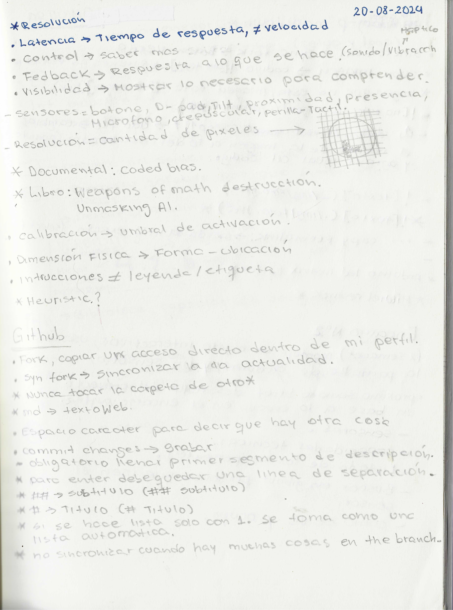
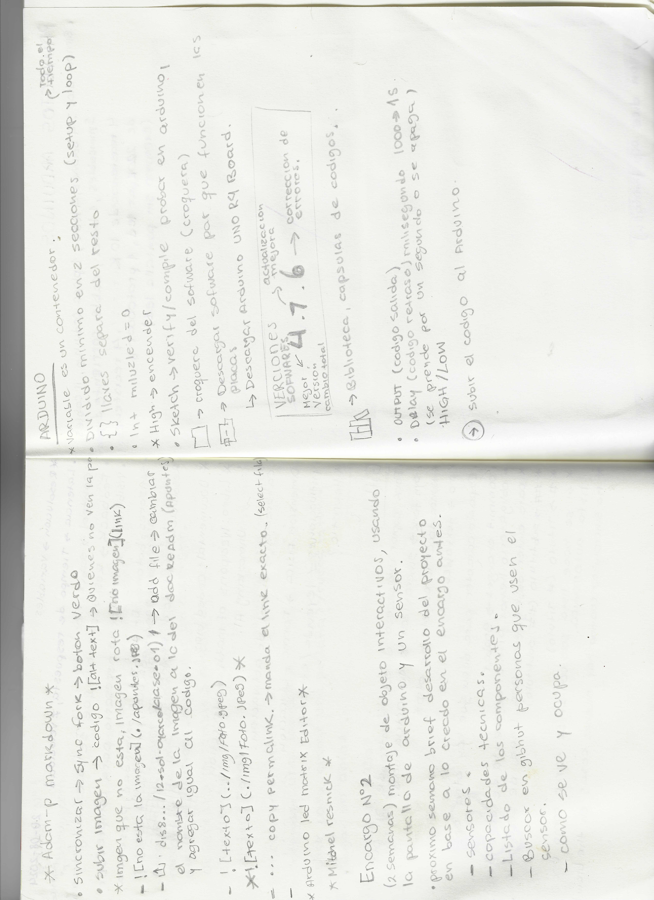

# clase-02
prueba uno

segunda prueba

## sensores  
1. lista
1. lista
1. lista

   
En la clase de hoy se abordo el uso de gibhub y como agregar imagenes en este, tambien se vio el uso de arduino R4.

Analisis de proyectos arduinos y diseño de juego

link de figma- analisis y propuesta de proyecto  
https://www.figma.com/board/YP1qNwRJMIWIlkufl3X2Um/Proyecto-Arduino?node-id=12-140&t=TsU5fz7terZ1nmuL-1
