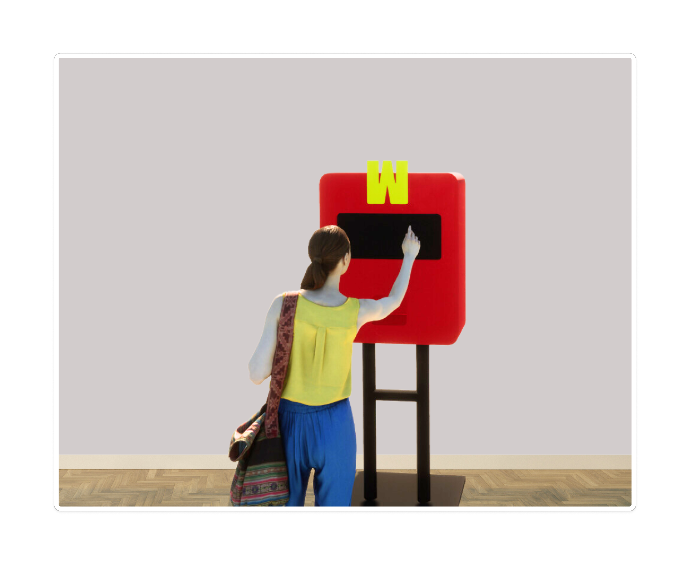
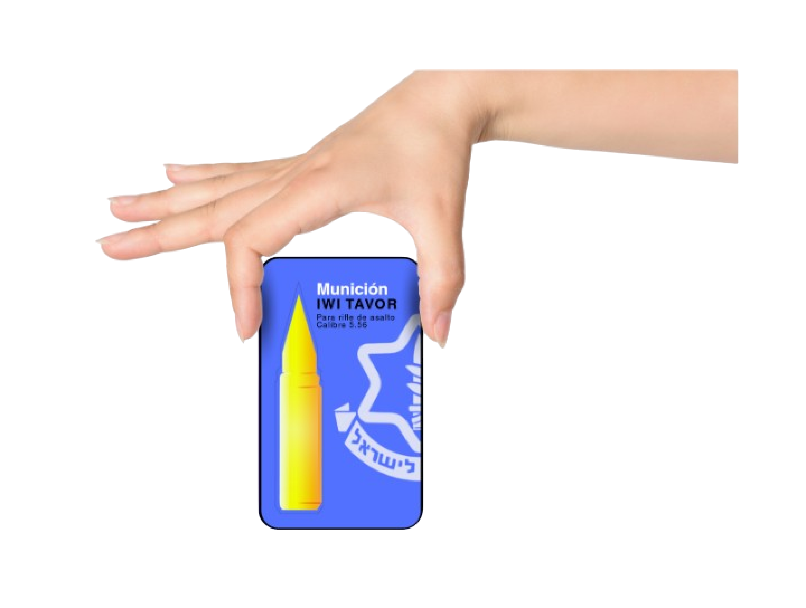

# clase-13
*PROYECTO: CAJITA DE LA CONCIENCIA*

## Diagrama de flujo 

Primer intento
.png)

Modificaciones en clases 

## Pseudocódigo

  - Variables
    
        let state = “STANDBY”
        let state Numero maximo de pasos A= “NMP_A”
        let < “NMP_A”
        let > “NMP_A”
        let state Numero maximo de pasos B = “NMP_B”
        let < “NMP_B”
        let > “NMP_B”
        let estate consumir = consumir
        let estate noConsumir = noConsumir
        let state Paso_A = 360°
        let state Pasos_B = 360°
        let scroll
        let tap menú
        let tap consumir
        let tap noConsumir
        let tap consumir = (girarUnPaso_A)
        let tap noConsumir = (girarUnPaso_B)
        let girar Paso_A = (motor_A == 360°)
        let girar Paso_B = (motor_B == 360°)
    
- Funciones

      mostrar pantalla StandBy
      mostrar pantalla Menu
      mostrar pantalla CargandoA
      mostrar pantalla CargandoB
      mostrar pantalla MensajeA
      mostrar pantalla MensajeB
      volver pantalla de inicio
      contar Consumir
      contar noConsumir
      contar Pasos_A
      contar Pasos_B
      girarMotor A
      girarMotor B

  ## Bocetos de Produccion
  
Inspo Wireframe
 .png)
 
 .png)
 
 .png)
 
 .png)

Wireframe

- Pantalla Stand By (Pregunta+ Menú)
  .png)

- Pantalla opciones de menú
  .png)

- Pantalla opciones de menú + No consumir
  .png)

- Pantalla de carga
 .png)

- Pantalla con mensaje (Dispensador vacío)
  .png)

Dimensiones generales

  .png)

Interacción

  .png)
  
  

 ## Disposición espacial del lab de interacción 
 *Creado por paula*
 
 

  
