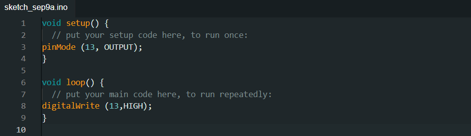
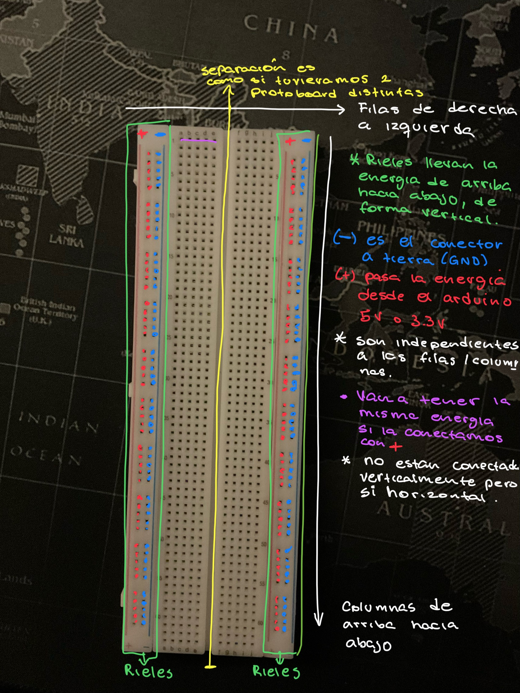
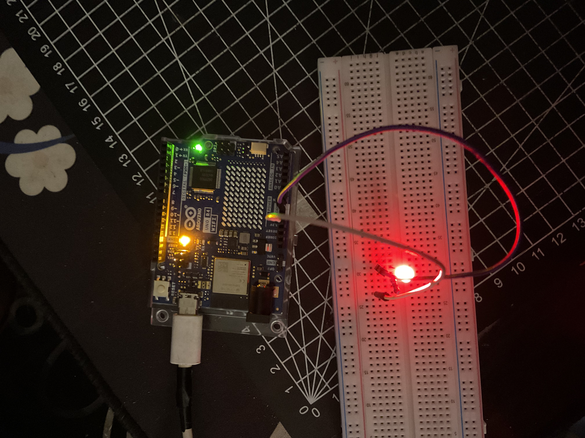

# clase-04

## APUNTES 

- Referente Camila remirez (creadora de juegos)
- Hacer un botón en base a lamina de cobre o aluminio en la esquina donde al hacer contacto la bolita con la pared inicie el tiempo.
- estado de espera: se debe realizar una accion para sacarlo de este estado
- stack overflow pag de codigos

const (comando que no varia a través del tiempo)

estado del botón 0 estado natural de las cosas 

setup (condición inicial)  termina la etapa cuando aparece }

Loop  repetir, programaciones que se iniciaran después del setup

High= verdadero  

´´´ (para citar en gibhub) - revisar gibhub profes clases profe

ctrl +f  - buscar una palabra y remplazar una palabra

Standby = quieto 

const (proteger una parte del codigo)

*BUTTON_PIN =numero - modificar el numero y se modificara en todo el codigo 

En el loop se usa switch modifica el estado - Switch (Standby)

if (revisaboton) - estadoActual= ACTIVO   esa accion dice que cada vez que se precione el boton realiza esa accion 

case TRABAJANDO:

Serial.println

Variable- boolean - true/false

ctrol+t- ordenar código

Umbrales-

*libreria adafrut es recomendada 

&& es para condicionar ej: if (distancia > Umbral - 15  &&  distancia  < Umbral){
}

> =o
> 
- estado s (No esta la bolita, esta la bolita y esta el tiempo, esta la bolita finalizo el tiempo)

CuentaRegresiva ()

case ACTIVO, 

CuentaRegresiva ()

if  (sensorFin ()  | |  cuentaRegresiv ( ) )

estadoActual = Trabajando

## LABERINTO

¿QUE ES?

Un juego de laberinto donde se busca alcanzar completar un circuito en un tiempo definido (mostrado por los led del arduino), donde  el jugador que logre llegar al final del juego antes de que finalise el tiempo definido  ganara el juego.

## Diagrama de flujo laberinto

tarea: quiero empezar a jugar 

casos límites:
que la pelotita no esté en el tablero.
que el tiempo empiece a correr y no esté la pelotita.
que el tiempo no corra.

 1. tomar el tablero con ambas manos, de manera horizontal.
 2. asegurarse de que la pelotita este en el tablero. Si la pelotita no está, buscarla dentro de la base.
 3. verificar que el tiempo en pantalla no esté corriendo.
 4. Tomar la pelotita y ubicarla en el inicio del laberinto.
 5. al momento de dejar la pelotita al inicio del laberinto, comienza el juego y empieza a correr el tiempo.
 6. verificar que el tiempo esté corriendo.
 7. comenzará a parpadear la pantalla, indicando que se agotará el tiempo límite.
 8. en 40 segundos, se deberá llegar al final del laberinto, terminando el juego.
 9. al llegar al fnal del laberinto, se mostrará una animación indicando que ganaste o perdiste.

## ¿COMO USAR ARDUINO?
PLACA ARDUINO 
- Apuntes en base a tutorial arduino de Johann Perez E ( https://www.youtube.com/watch?v=gx5yFvVDUsY&list=PLyLh25DppBIe40j3VBAslnVfs4Pz-B3ZB ) Johann Perez E

**PROGRAMAR** 

***void setup* ()** solo se ejecuta una vez 

***void loop* ()** se ejecuta constantemente  

***void setup > pinmode* *(13, OUTPUT);***  avisa a Arduino que usare uno de los pines  *OUTPUT*  enviar info  **y se usa ; para finalizar

Enviando info a través de lod pines ***void loop()> digitalWrite* *(13,HIGH);***  para prender el led

Para apagar el led 13  ***void loop()> digitalWrite* *(13,LOW);***  

al escribir bajo este el tiempo que se demore en encender ***delay(1000);***  se mide en milisegundos y si lo volvemos a agregar bajo  LOW >  ***delay(1000);***  se prende y apagara la luz en 1000 milisegundos

USO DE LA PROTOBOARD (TARJETA DE PROTOTIPADO)

LEDS : Pata larga es (+) y la pata corta (-) por lo que el LED se debe conectar de forma vertical ( Ej: en la fila 30 el polo positivo y en la 31 el negativo )  

RESISTENCIAS:  Para que pase solo la energía necesaria (para el ejemplo se usara una resistencia de 220v la patita quedara al positivo del led)

CABLE JUMPER: se usan los cables oscuros para aludir al - y el mas claro al +  el cable se pasa primero por la resistencia  (el mas claro +) luego conecto el cable a tierra , conectándolo al negativo del LED (cable oscuro -)

PROGRAMAR EL  LED
luego para programar el LED se agregan 2 cables para conectar al pin 8 y al de tierra

programando lo siguiente 

https://youtube.com/shorts/_zaioiT6iik  Parpadeo LED

y si se queremos  queremos crear una variante en las velocidades se debemos volver a agregar los códigos  las veces que queramos y modificar el tiempo (con este parpadea 3 veces lento y 3 veces rápido)

## INTENTOS PROGRAMACION 
No nos funciono la biblioteca del sensor CapacitiveSensor.h
1. Sensor tactil capacitivo por Rincon Ingenieril Youtube https://www.youtube.com/watch?v=V3l2Vj3lXZU
   codigo :

   //Sensor Tactil capacitivo por Rincon Ingenieril
//Uso de la libreria CapacitiveSensor.h de Paul Stroffregen

#include <CapacitiveSensor.h>

CapacitiveSensor sensor = CapacitiveSensor(4,3);

void setup() 
{
  // put your setup code here, to run once:
pinMode(12,OUTPUT);
}

void loop() 
{
  // put your main code here, to run repeatedly:
long lectura = sensor.capacitiveSensor(30);

if(lectura>1)
digitalWrite(12,HIGH);
else
digitalWrite(12,LOW);

delay(10);
}

CONEXION DEL ARDUINO

