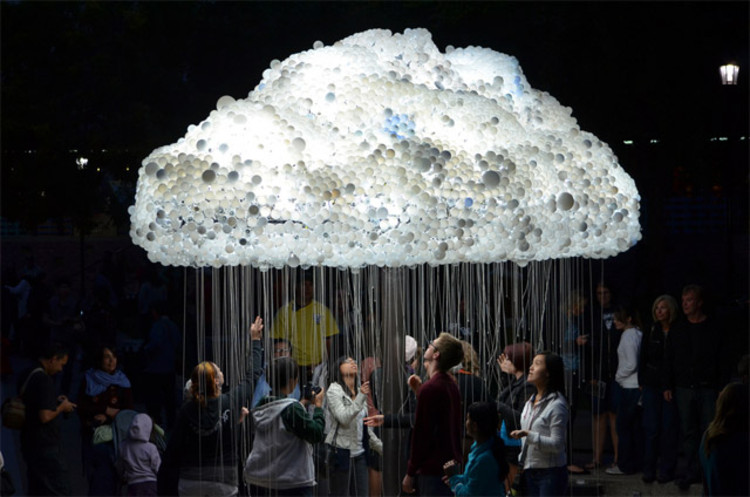

# clase-06 segunda parte del semestre

Analizando podemos creas experiencias y proyectos de diseño de interaccion, que influyen en las personas 
de forma positiva sensorialmente
.

-------Dieter Rams diseñador alemnan-------

# Form follows ¿functión or form or interactión? 

DISEÑAR PARA EL COMPORTAMIENTO Y MENOS POR LA FUNCIONABILIDAD
¿O TAL VEZ VA UNIDOS>?
