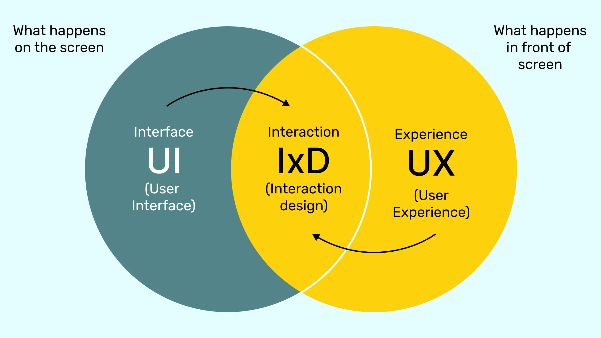

# clase-06 segunda parte del semestre
Analizando podemos creas experiencias y proyectos de diseño de interaccion, que influyen en las personas 
de forma positiva sensorialmente.

.

# Form follows ¿functión or form or interactión? 
-------Dieter Rams diseñador alemnan-------
DISEÑAR PARA EL COMPORTAMIENTO Y MENOS POR LA FUNCIONABILIDAD
¿O TAL VEZ VA UNIDOS>?

.

# Como programar el wifi del arduino
Asignar plca arduino uno r4wifi
examples - wifis3 - scan networks.
