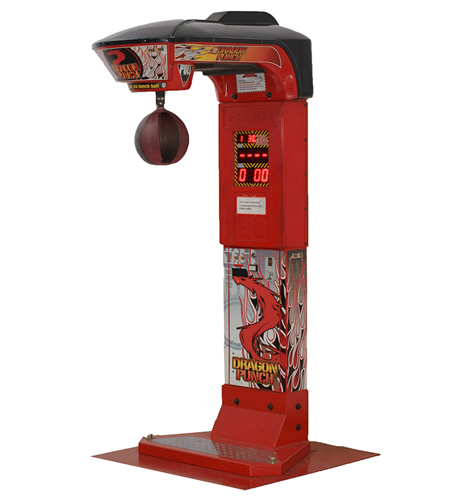
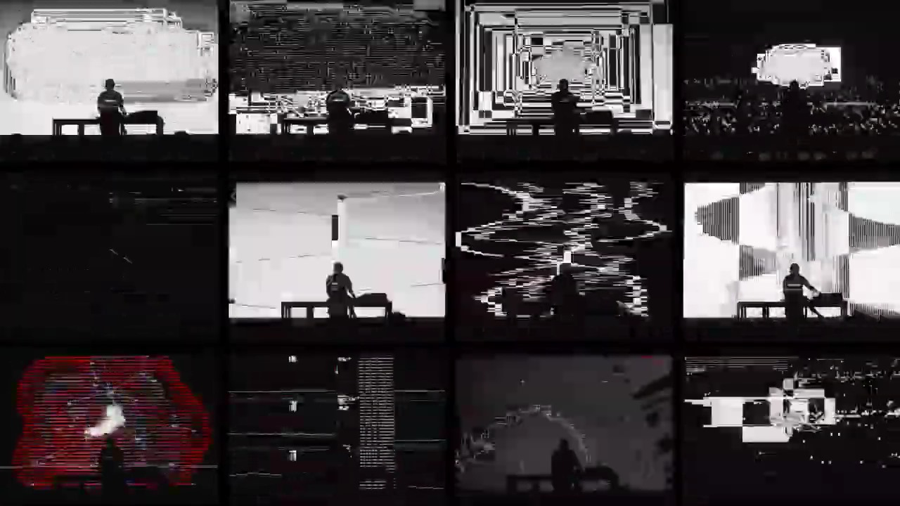

# MAQUINA DE LOS RENCORES

Nace desde las dinámicas tóxicas que se implementan en distintos ambientes, en este caso son el ambiente laboral y universitario (pueden ser desde los cahuines, la competencia entre estudiantes, las funas e incluso las agresiones verbales). Todo esto se va a mostrar a través de una instalación que contiene piezas físicas y digitales, de las cuales, la parte física tiene tres maneras de interacción, todas interacciones tienen el fin e demostrar su frustración hacia actitudes de este tipo.

## Todo consta de cuatro espacios: 

1. Elegir a tu "enemigo":  Esto a través de una pantalla en la cual se puede escribir o seleccionar su nombre. La lista obviamente puede no tener nombre reales, puede tener apodos o incluso una descripción de la persona en cuestión con la que se tine el conflicto. 
2. Expresar el conflicto con la instalación:
  - Golpea la máquina: Se puede hacer una estructura firme pero acolchada para que nadie se lastime. Esta va a tener sensor de movimiento o sensores de impacto para recibir el golpe y emitir una respuestaLa forma de esta parte interactiva puede ser como la típica maquina de arcade para golpear 
  - Romper objetos: Se pueden implementar figurines que sean representativos con este tipo de conflictos, de los cuales el usuario puede seleccionar uno y romperlo.

3. Escalas y gráficos: A medida en que los usuarios vayan interactuando con la instalación de manera violenta, esta responderá con más violencia aún, ya sea de manera visual o auditiva:

- Referente para esto: Ryoji Ikeda[Referencia](https://youtu.be/RGqX6kDjNI8?feature=shared.webm)
-
- 
- pantallas que muestren gráficos en los que se muestren las interacciones hechas
- sonidos que sean agresivos onda, gritos, cosas rompiéndose, alarmas y cosas así.

4. Acumulación de rencores: A medida que más personas interactúan con la instalación, se genera una acumulación de respuestas y datos sobre quienes están más funados, todo esto se va a visualizar en una pantalla en donde el "enemigo" más golpeado sube en el ranking. El ranking puede tener un numero en especifico al que se llegue y en la pantalla se muestren no sé explosiones y volaitas así o, podría ser un ranking que vaya variando en quien lo pasa y que a partir de eso se muestren todas esas cosa en la pantalla.

## Referencia: [Golan Levin "Arte que te mira"](https://www.ted.com/talks/golan_levin_art_that_looks_back_at_you/transcript?subtitle=en&geo=es)

#  EL PESO DE TUS DECISIONES

Los usuarios participarán en un dilema sobre el consumo de productos fabricados bajo condiciones que implican explotación laboral, daño ambiental o crueldad animal. Se les realizará preguntas como: ¿Qué tanto estarías dispuesto a sacrificar para obtener bienes que realmente deseas a un menor costo, sabiendo las consecuencias éticas de esas decisiones? Poniendo a prueba el egoísmo del usuario jugando con preguntas que presentan dilemas éticos

# Esta propuesta consta de 3 estados:

1. Presentación de la pregunta base: En una de las 3 pantallas de la exposición, preferentemente en la que se ubica al medio se proyectan las preguntas como, por ejemplo:
"¿Comprarías un par de los zapatos de tus sueños a un precio muy bajo sabiendo que fueron fabricados bajo explotación infantil y matan a 5 cualquier animal para poder realizarlos?
"¿Elegirías una marca que contamina ríos de manera absurda si eso reduce el costo de tu producto favorito de toda la vida?"
Las preguntas son al azar y son predeterminadas

2. Selección de una alternativa:  El usuario deberá elegir entre dos alternativas proyectadas en la pantalla, seleccionando una opción mediante botones asignados específicamente a cada alternativa. Solo habrá dos opciones disponibles para tomar una decisión. 

3. Consecuencia de tus decisiones, el peso de tus decisiones: A través de una pantalla se reciben los datos en tiempo real de las votaciones, cada elección desencadena un cambio visual en las pantallas. Por ejemplo:
-	Si el usuario selecciona una opción "egoísta" (prioriza el precio sobre la ética), múltiples pantallas mostrarán la palabra "Egoísta" de forma repetitiva, acompañada de una animación impactante que refuerza el mensaje. Al mismo tiempo, un sonido intenso y agobiante llenará el espacio, provocando angustia e incomodidad. Este malestar solo podrá aliviarse si el usuario es capaz de retirar un objeto muy pesado de una zona designada. Este peso simbólico representará la carga de conciencia que el usuario debe llevar tras su elección.

-	Si el usuario selecciona una opción "ética" (prioriza la justicia y la sostenibilidad), las pantallas mostrarán el mensaje: "Solo te estábamos poniendo a prueba. ¡Qué bueno que eres una persona respetable!". Este mensaje estará acompañado por sonidos de aplausos y ovaciones, creando una sensación de reconocimiento y validación por haber tomado una decisión moralmente correcta.

# TU ELECCIÓN FAVORITA 

La propuesta consiste en captar y visualizar información en tiempo real, que genere emociones fuertes en el usuario principalmente culpa, la temática es sobre las marcas que ayudan a financiar la guerra de palestina que muchos consumen de manera inconsciente sin saber a como afectan sus decisiones de consumo sobre otros. 

El proyecto utiliza una votación interactiva para reflejar cómo las marcas que usamos diariamente pueden estar vinculadas a la perpetuación de conflictos bélicos.

## El sistema tiene dos partes: 
•	La primera es la interacción del usuario con una interfaz en donde puede seleccionar a través de apretar botones para poder seleccionar marcas o productos de consumo regular, sin mayor contexto previo. 

•	La segunda parte es la visualización en tiempo real, en donde muestra a los usuarios las marcas que seleccionaron están ligadas a la financiación de la guerra en Palestina, esto va de la mano de un componente emocional que genera culpabilidad al usuario 

## Pasos de la propuesta
1.  Los usuarios serán presentados con un panel de opciones (botones) que presenta marcas populares o de consumo (puede ser de cualquier tipo). En la pantalla no habrá nada que de indicios de lo que se trata la exposición, iniciando con una interacción básica, que diga “Selecciona las marcas que consumes de manera habitual” o “el día a día” o “tu marca favorita”

2. A medida que los usuarios seleccionan distintas marcas, el sistema las vinculará con datos reales sobre su participación en conflictos, como el de Palestina. Al hacer una elección, se activará un rociador que salpicará líquido rojo, simulando la sangre metafórica que el usuario tiene en sus manos. Alternativamente, se podría llenar un recipiente de forma gradual, acompañado del mensaje: "Toda esta sangre está en tus manos".
## Los mensajes que aparecerán para acompañar la experiencia podrían ser:

•	"Esta marca ha invertido millones en empresas que suministran armas a las fuerzas ocupantes en la guerra de Palestina."
•	"¿Sabías que al consumir esta marca estás ayudando a financiar la destrucción de hogares de miles de personas en Gaza?"
•	"Esta marca invierte en la industria armamentística. ¿Cuántas vidas ha destruido tu última compra?"
Esta combinación de efectos visuales y mensajes busca intensificar el impacto emocional, generando una sensación de responsabilidad directa por las consecuencias de sus decisiones de consumo.

Se podrían utilizar gráficos mostrando datos duros e imágenes de la situación que vinculen directamente el consumo cotidiano con la tragedia de la guerra.

3. Cierre Impactante: Al final de la experiencia, la pantalla puede mostrar el mensaje:
"¿Sabías que cada compra cuenta? Tú decides: contribuir a la paz o a la guerra." 

Al finalizar se podría mostrar datos de alguna fundación que ayude a personas afectadas por este conflicto bélico.

# CLASE 09

Páginas útiles: 16n federbank - octopart
