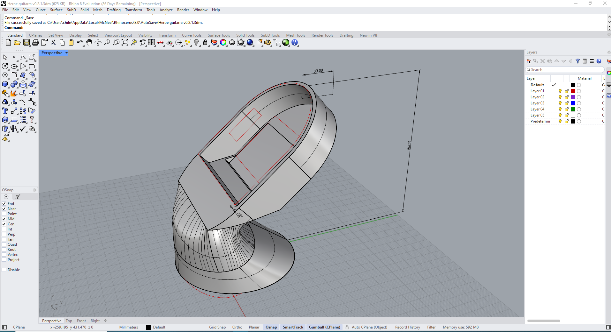

# clase-03

# Correccion
Especificar mas en detalle las singularidades del proyecto (definir) 
definir o investigar mejor forma de interaccion con el ritmo o los puntos a tocas.

# Encargo 1 / LINK BRIEF INFORMATIVO DE PROYECTO:
https://www.figma.com/board/73baQbvoc15cwFXiWEnhS4/TALLERSITO?node-id=81-19&t=MGgFbpLIqgTaGfTu-0

LINK PARA APRENDER A PROGRAMAR LOS LEDS DEL ARDUINO UNOR4: https://docs.arduino.cc/tutorials/uno-r4-wifi/led-matrix/#resources 

# MODELADO PROTOTIPO 0.1.1
.

# HEROE GUITARRA 0.1.1
A partir de las variables ergonomicas y de funcionabilidad se busca emplear una forma que argumente solidamente las expresiones literales del juego, dando asi la sensacion al usuario que esta ocupando una consola.
Se esperan modificaciones de los mismos conceptos mencionados anteriormente /ergonomia y funcionabilidad/ 

ya se esta trabajando en la version 0.2.1 la cual solucion en forma parcial la forma con respecto a los botones y el accionar del dispositivo.

Empezar las actividades sii te hace estar bajo juramento o implementar ciertas obligaciones a tu profesionalismo, pero ayuda tambien a darle mas valos a tu trabajo emitiendo boletas y cumpliendo con la ley conforme a los servicios entregados.

# MODELADO PROTOTIPO 1.2.0
.
