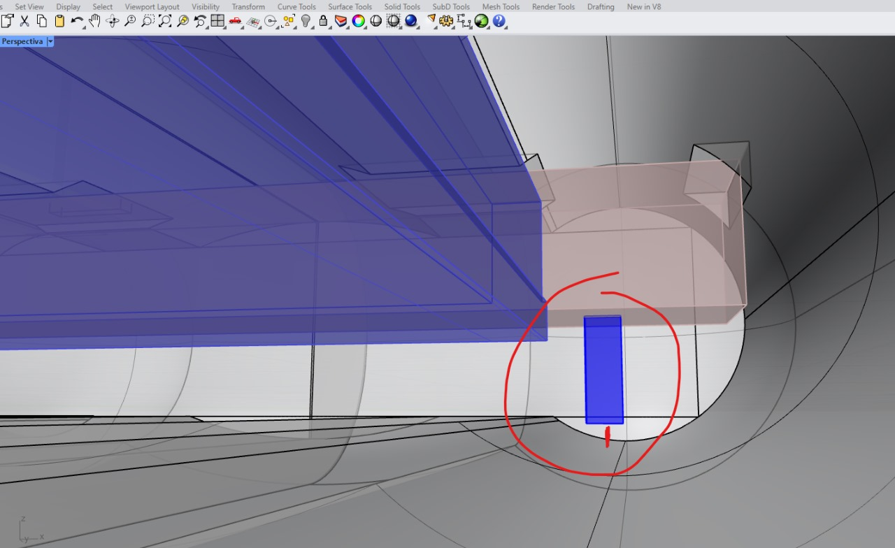
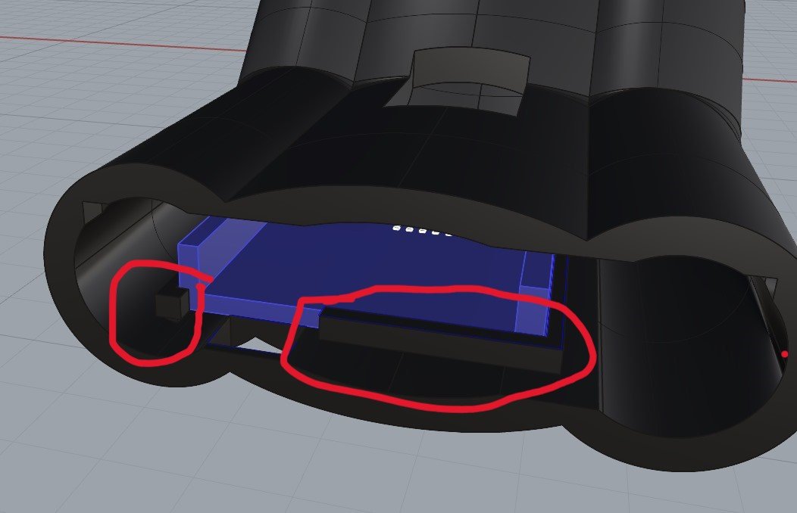

# clase-04 

# ¿QUÉ ES HEROE GUITARRA?
Heroe Guitarra es un dispositivo electrónico inspirado en el modo de uso mas común de un instrumento: un acorde accionable y una pulsación. HEROE GUITARRA tiene 3 carriles en donde están posicionados los acordes que deberemos accionar, éstos acordes estarán repartidos aleatoriamente.

# OBJETIVO DEL JUEGO
Heroe Guitarra es un juego portatil dónde podrás escuchar las melodías más famosas del mundo... sólo si tienes la destreza para que suceda.
Cada nivel contiene una serie de acordes que conformarán la melodía. Toca los acordes rápido y llega hasta el final del patrón, solo ahí podrás pasar al siguiente nivel.

# REFERENTES
.
.
.

# modelado Heroe guitarra  ////// Decisiones de diseño.

.

# IDEA PARA PEGAR PIEZAS
Ésta era una idea dada la condiciÓn de que partieramos en 4 nuestro prototipo para luego pegarlo sin problema y que no se mueva.

.

# DATO!!!  
En cualquier encaje es necesario dar tolerancias de al menos 0,15 mm a 0,30mm, para que el factor impresión no provoque fallos en nuestro encaje.

.

# SE DEFINIÓ PARTIR EL PROTOTIPO EN 4
Para mejorar el tiempo de impresión, reducir fallos y ensamblar todo el sistema electrónico.

.

# CONTENEDORES DEL ARDUINO
Se pensaron estan paredes para limitar el movimiento del arduino dentro del sistema de izquierda a derecha, pero aún se seguia moviendo en el eje z. funcionó! y se incorporó
.

 # Avance de cómo logramos que según la ubicación del potenciómetro, se cambie el frame que deseamos.
 
/*
  Single Frame
  
  Displays single frames using matrix.loadFrame
  
  See the full documentation here:
  https://docs.arduino.cc/tutorials/uno-r4-wifi/led-matrix
*/

#include "Arduino_LED_Matrix.h"  // Include the LED_Matrix library
#include "frames.h"              // Include a header file containing some custom icons
int potPin = A0;
ArduinoLEDMatrix matrix;  // Create an instance of the ArduinoLEDMatrix class

void setup() {
  Serial.begin(115200);  // Initialize serial communication at a baud rate of 115200
  matrix.begin();        // Initialize the LED matrix
}

void loop() {

  int potValue = analogRead(potPin);
  // Load and display the "chip" frame on the LED matrix

  int carril = map(potValue, 0, 1023, 0, 2);

  if (potValue > 140 && potValue < 401) {
    matrix.loadFrame(frame1);

  }

  // Load and display the "danger" frame on the LED matrix
  else if (potValue > 400 && potValue < 639) {
    matrix.loadFrame(frame2);
  }

  // Load and display the "happy" frame on the LED matrix
  else if (potValue > 638 && potValue < 890) {
    matrix.loadFrame(frame3);

    // Print the current value of millis() to the serial monitor
    Serial.println(millis());
  }
}

.

