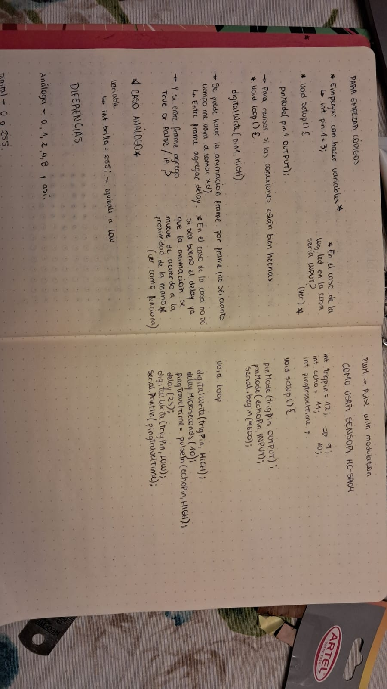

# clase-05

## avance

De acuerdo a las correcciones hechas por el equipo en general, decidí agregarle color a la fachada de la casa paea que fuera más apegada a la casa original (de la película). 

Se agregó una luz led roja para indicar su uso y el sensor se dejó en la parte trasera en la base de la casa. 

 

 

Para el espacio del sensor me equivoqué por tres milimetros y solo calza bien una parte :(, pero todo tiene solución!


## Lento y seguro

Código de prueba para luz led externa

```cpp
int pinred = 11;
void setup() {
  // put your setup code here, to run once:
 pinMode(pinred, OUTPUT);
}

void loop() {
  // put your main code here, to run repeatedly:
digitalWrite(pinred, HIGH);
delay(1000);
digitalWrite(pinred, LOW);
delay(1000);
}
```
He estado estudiando un poco más ya que no entendía nada, ahora, gracias a las recomandaciones de mis compañeros en el ds me he podido enchufar jeje. 

 

Configuración de espacio dentro de la casa (la cinta de papel es solo para la foto, no va a quedar como soporte) 


Videos que me han servido mucho: 
[funcionamiento de luces led](https://youtu.be/yOEjuyvK62k?feature=shared)

[como funciona el sensor HC-SR04](https://youtu.be/xFZCpR-5xg4?feature=shared)

[cosas que no habia entendido](https://youtu.be/aA5ZpFySimw?feature=shared) 

## avance de código completo 

(aún hay un detalle) 

```cpp
// Incluir librerías para trabajar con la matriz LED
#include "Arduino_LED_Matrix.h"
#include "globito.h"
#include "animation.h"

ArduinoLEDMatrix Pantalla;  // Instancia del objeto

enum State {
  STANDBY,
  ACTIVO
};

const int ledPin = 13;

// Pines para el sensor de proximidad
const int pin_trig = 2;
const int pin_echo = 4;
int distance;

// Configuración de distancias para activar el LED
const int noHayNadie = 60;  // Encender el LED 13 desde los 21 cm
const int noHayNadie2 = 100;  // Seguir encendido el LED hasta los 100 cm
const int hayAlguien = 0;     // Apagar el LED y comenzar la animación de la matriz desde los 0 cm
const int hayAlguien2 = 20;    // Seguir encendida la pantalla hasta los 20 cm
// cuando no hay nadie esta prendido el led rojo y al detectar distancia se apaga

State currentState = STANDBY;

void setup() {
  Pantalla.begin();
  pinMode(pin_trig, OUTPUT);
  pinMode(pin_echo, INPUT);
  pinMode(ledPin, OUTPUT);

  Serial.begin(115200);
}

void loop() {
  readDistance(); // Lee la distancia del sensor

  switch (currentState) {
    case STANDBY:
    //aqui se reproduce la animacion del globito en espera y el led se mantiene prendido
      Serial.println("En estado STANDBY");
    
      if (distance >= noHayNadie && distance <= noHayNadie2) {
        digitalWrite(ledPin, HIGH);
        Pantalla.loadSequence(globito);  
        Pantalla.play(true);
        currentState = STANDBY;
      } else {
        currentState = ACTIVO; 
      }
      break;
      // en estado satndby poner que se mantiene prendido el led

    case ACTIVO:
      Serial.println("En estado ACTIVO");

      if (distance >= hayAlguien && distance <= hayAlguien2) {
        digitalWrite(ledPin, LOW);
        Pantalla.loadSequence(animation);  
        Pantalla.play(true);
        currentState = ACTIVO;
      } else {
        currentState = STANDBY; 
      }
      break;
  }
}

void readDistance() {
  digitalWrite(pin_trig, LOW);
  delayMicroseconds(2);
  digitalWrite(pin_trig, HIGH);
  delayMicroseconds(10);
  digitalWrite(pin_trig, LOW);
  
  long duration = pulseIn(pin_echo, HIGH);
  distance = duration * 0.0344 / 2;  // Convertir a centímetros
}
```

