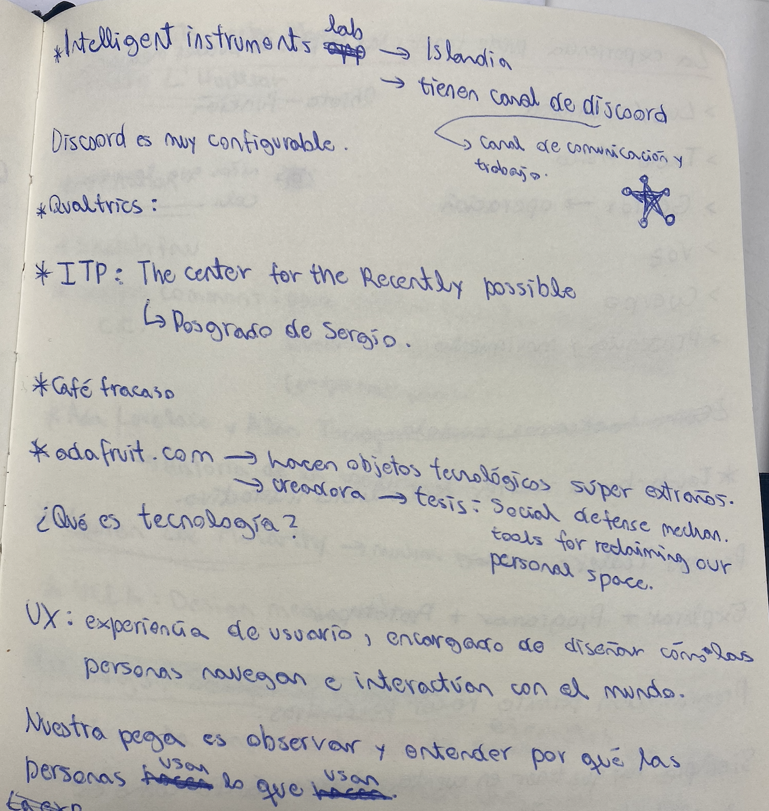
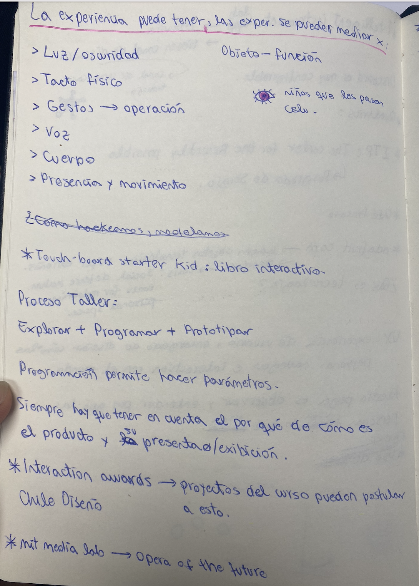
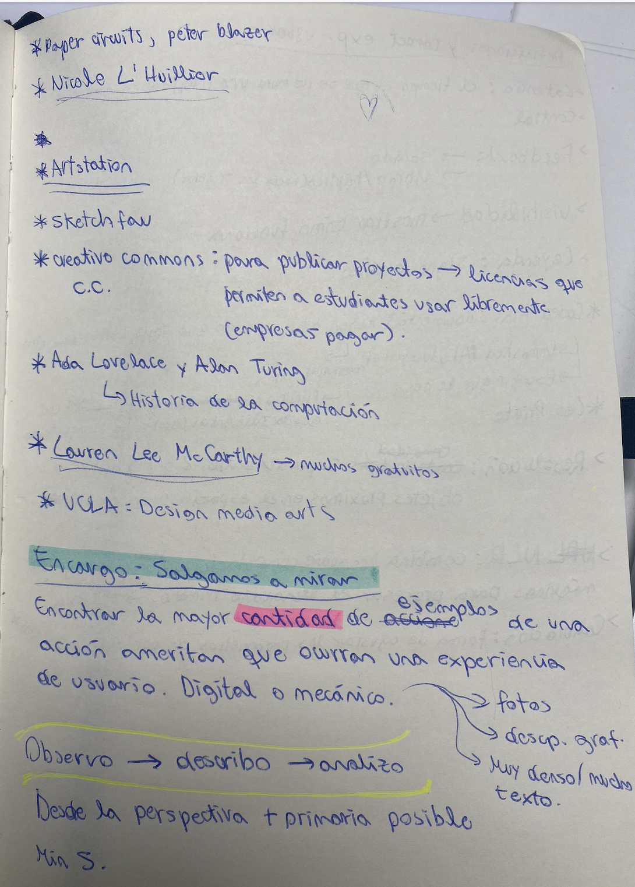
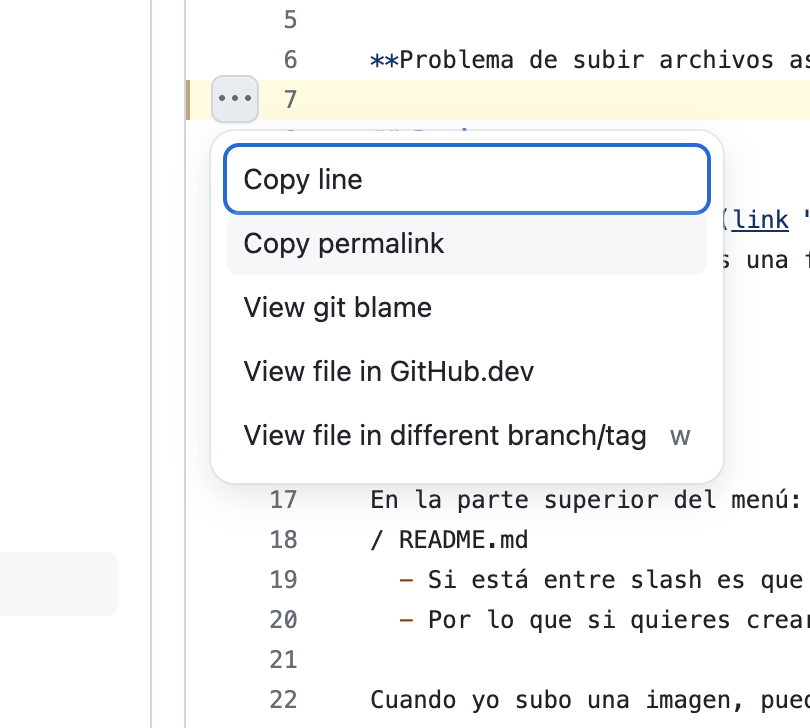

# clase-01

## Revisar

- Lo que está en el () es una frase que aparece si hago hover sobre mi imagen

![esta imagen no existe]

En la parte superior del menú: dis8637-2024-2/18-BelenVeAg/clase-01
/ README.md

- Si está entre slash es que es una carpeta.
- Por lo que si quieres crear una carpeta, hay

Cuando yo subo una imagen, puedo entrar a la imagen y con el ícono de 3 puntos la puedo borrar. También hay otra opción para editar el nombre de la imagen. En ese mismo lugar de editar el nombre de la imagen, si pones: nombrex/ imagen.jpg , se crea una carpeta nombrex   donde la imagen se guarda.

./ es para decir "esto vive aquí", para decirle al programa dónde debe buscar mi archivo. Como escribir enlaces en el compu

../ = de donde estoy, una carpeta carpeta más atras. Mientras más puntos, más carpetas atrás.

Al visualizar un código puedes ver tres puntitos en las líneas de código y si lo apretas puedes apretar la opción de crear un link permanente que siempre te va a llevar eso.

