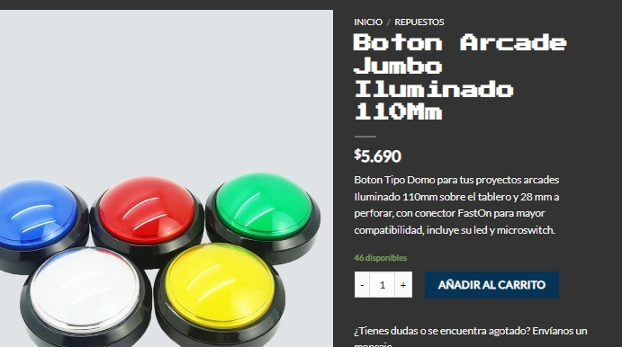
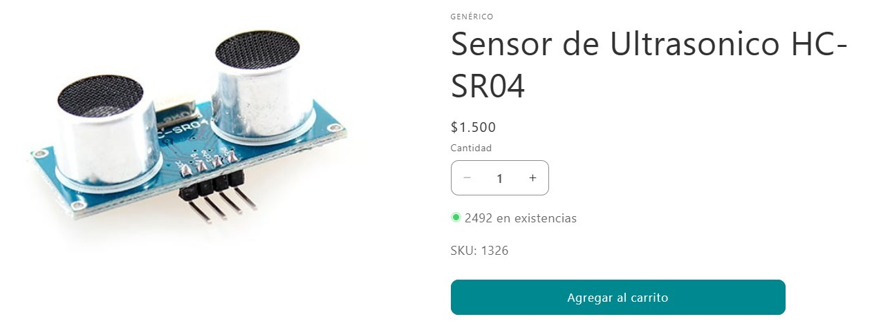
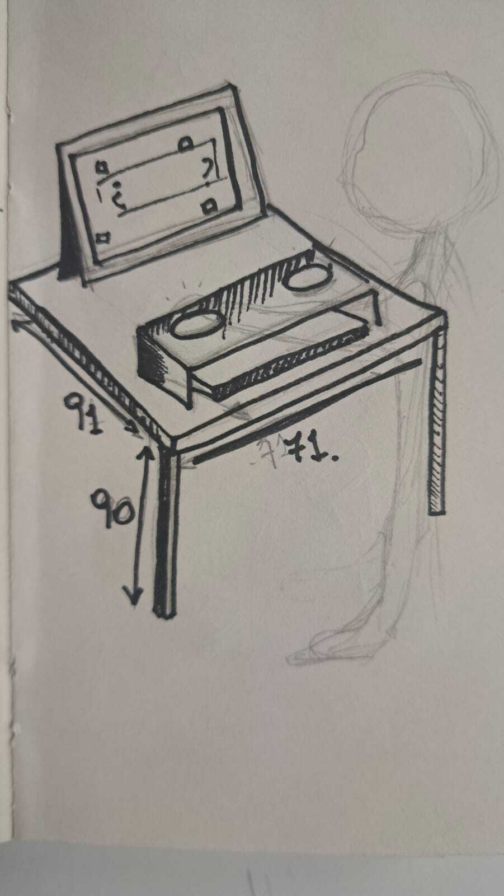

# clase-14
## Proceso y fabricación 
Acá se encuentra el diagrama de flujo:
https://www.figma.com/board/K9ENLHmyeRFhBFHRfYvlJm/Untitled?node-id=0-1&node-type=canvas&t=WcxYp7IF98apcovJ-0
El propósito de éste proyecto es visibilizar a las autoridades sobre el estrés académico, el cual en temporada de Diseño abierto aumenta exponencialmente y queremos evidenciar en vivo y en directo de cuantos alumnos tienen un estrés alto. 

Debemos tener en cuenta tanto los materialeas que usaremos como la cotización de éstos debido a que se tomará en cuenta cuantos debemos gastar y utilizar lo menos recursos posibles.
 Para ello contamos primeramente con los materiales los cualers son la madera mdf la cual gracias a la compañera cata debemos tener en cuenta la caja en donde se soprtaran los botones de si y no, para ello debemos entender de las dimensiones dadas de los objetos. 

 Botón Jumbo para la pregunta de "sí o No"
//  
Sensor para utilizarlo esto cuando el ususario quisiera responder las preguntas 
//  

Manual de uso 
### Bocetos 

Medidas estan en cm y es la mitad de una mesa, ya que se compartirá la mesa con el grupo de los votos, estructura en la cual estarán los botones serán hechos con material mdf, así mismo el teclado que finalmente tiene costo cero ya que tengo uno y también fue gratis.

// 

Se debe buscar pantalla para el proyecto debido a que si es muy grande po
//  dria invadir espacio de la botonera, la que priemrramente era una estructura grande pero se descarta debido a que quita tiempo y dinero, tambien contemplando el tiempo que nos queda para el exámen.
